# Snake, Flappy Bird, 2048, Connect Four, Chess and Wordle for the TI-Nspire CX II

Six games written in TI-Nspire Lua. They install by drag-and-drop — no
Ndless, no jailbreak, no root.

**Grab [`Snake.tns`](Snake.tns), [`Flappy.tns`](Flappy.tns),
[`2048.tns`](2048.tns), [`Connect4.tns`](Connect4.tns),
[`Chess.tns`](Chess.tns) or [`Wordle.tns`](Wordle.tns) and copy it onto your
calculator.**

## Snake

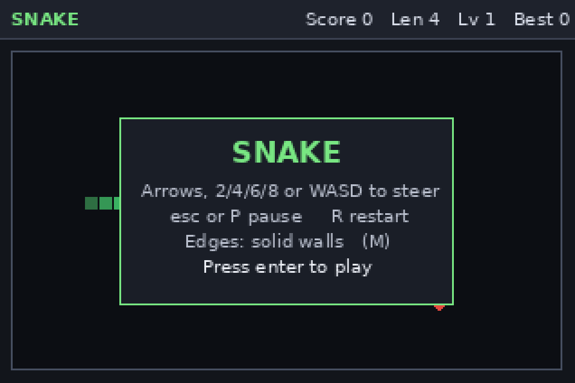
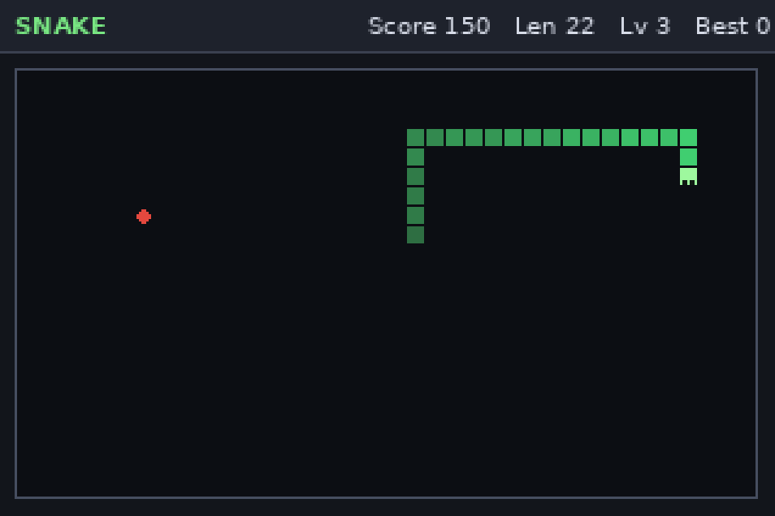

| Key | Action |
| --- | --- |
| Arrows, `2`/`4`/`6`/`8`, or `WASD` | Steer |
| `enter` or space | Start, resume, play again |
| `esc` or `P` | Pause |
| `R` | Restart |
| `M` | Toggle solid walls vs. wrap-around (between rounds) |
| Click | Steer toward the click; confirm on menus |

Apples are worth `10 x level`. Every 4 apples raises the level and the snake
speeds up, to a cap at level 10. Following your own tail is legal — the cell
your tail is leaving this move is safe to enter. Fill the whole board and you
win.

## Flappy Bird

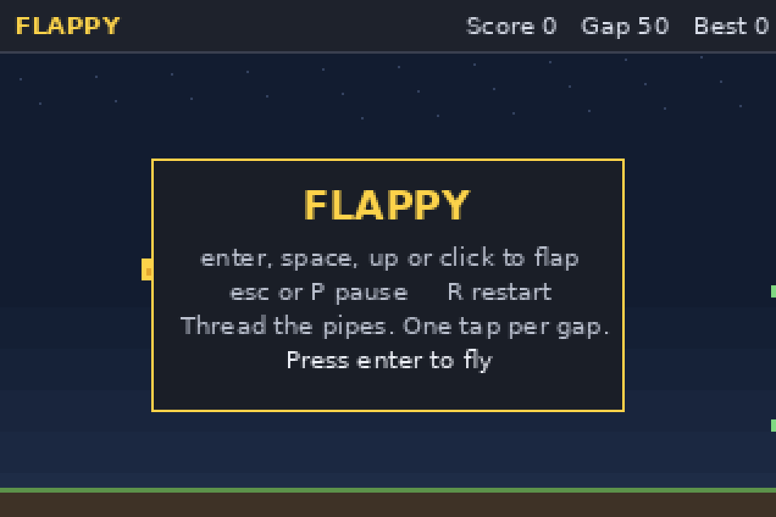
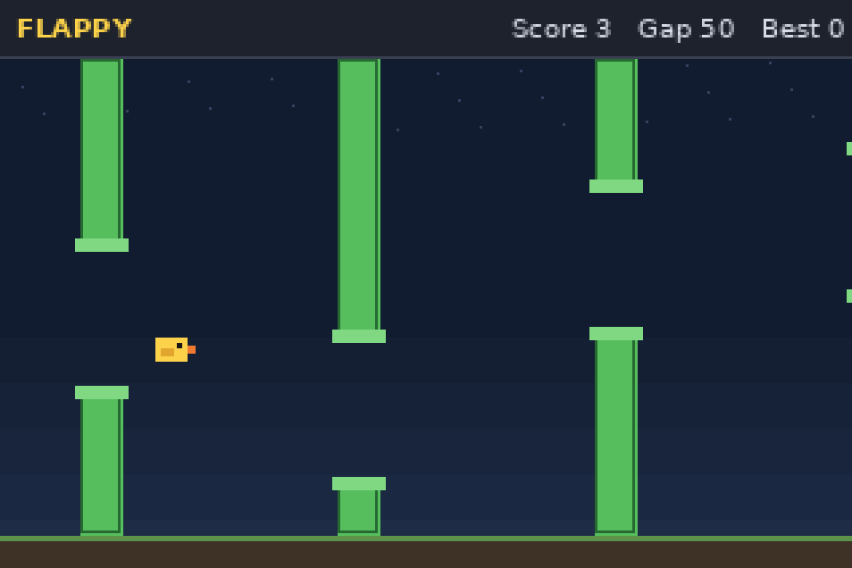

| Key | Action |
| --- | --- |
| `enter`, space, up arrow, `W`, `8`, `F`, or click | Flap |
| `esc`, `P`, or down arrow | Pause |
| `R` | Restart |

One tap per gap. The bird only ever goes up when you tell it to, and the flap
*sets* its speed rather than adding to it, so a tap out of a long dive lifts
exactly as much as a tap from a hover — panicking works. Each pipe cleared is
a point, and the gap tightens every 5 pipes down to a floor it never goes
below.

The pipe course is generated so that **every gap is reachable from the one
before it**. Dealt at random, a low gap followed by a high one is simply
impossible past some distance, and you lose to the generator instead of to
your own thumbs. Instead the generator is fenced by the physics: it asks how
far the bird can actually climb in the frames between two pipes, given the
gravity and flap strength in force, and never places a gap outside that. See
`src/flappy/game.lua` — and `tests/flappy/run.lua`, which checks the property
three ways: the arithmetic of the band, the courses actually produced, and a
deliberately crude autopilot that has to fly them.

## 2048

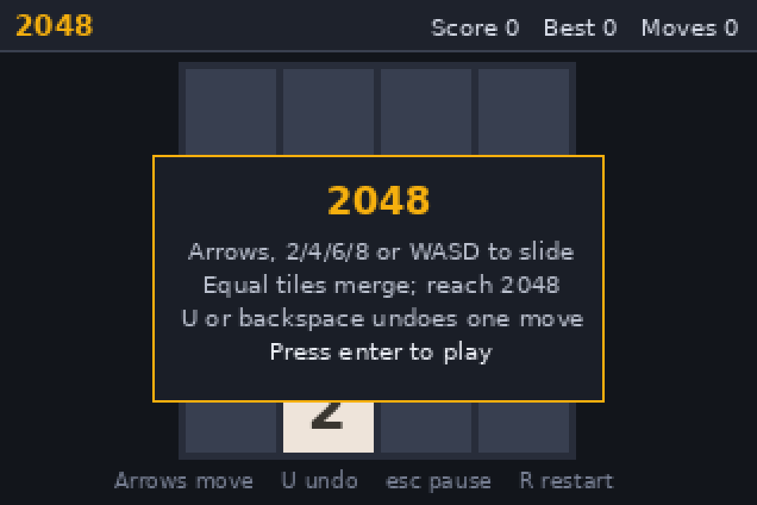
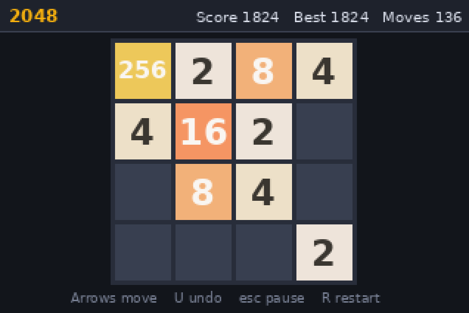

| Key | Action |
| --- | --- |
| Arrows, `2`/`4`/`6`/`8`, or `WASD` | Slide the board |
| `enter` or space | Start, resume, keep going past 2048, play again |
| `esc` or `P` | Pause |
| `U` or `backspace` | Undo one move |
| `R` | Restart |
| Click | Slide toward the side of the board you clicked |

Slide the whole board at once; equal tiles that collide merge into their sum,
and the score goes up by whatever each merge produced. A tile that has just
merged is spent for the rest of that move, which is why a row of `4 4 4 4`
becomes `8 8` and never `16`. Which pair merges first depends on the direction
you pushed: `4 4 4` gives `8 4` going left, but `4 8` going right.

A move only counts if it changes something. Push against a wall nothing can
move toward and nothing happens — no new tile, no score, and the turn is not
spent. After every move that *did* change the board, a new `2` (or, one time in
ten, a `4`) appears on a uniformly chosen empty cell.

The round ends when **no** direction would change the board, which is not the
same as the board being full — a full board with two equal neighbours still has
a move in it. `U` or `backspace` undoes one move, the one that ended the round
included, which is worth having when a mis-keyed arrow costs you the game.

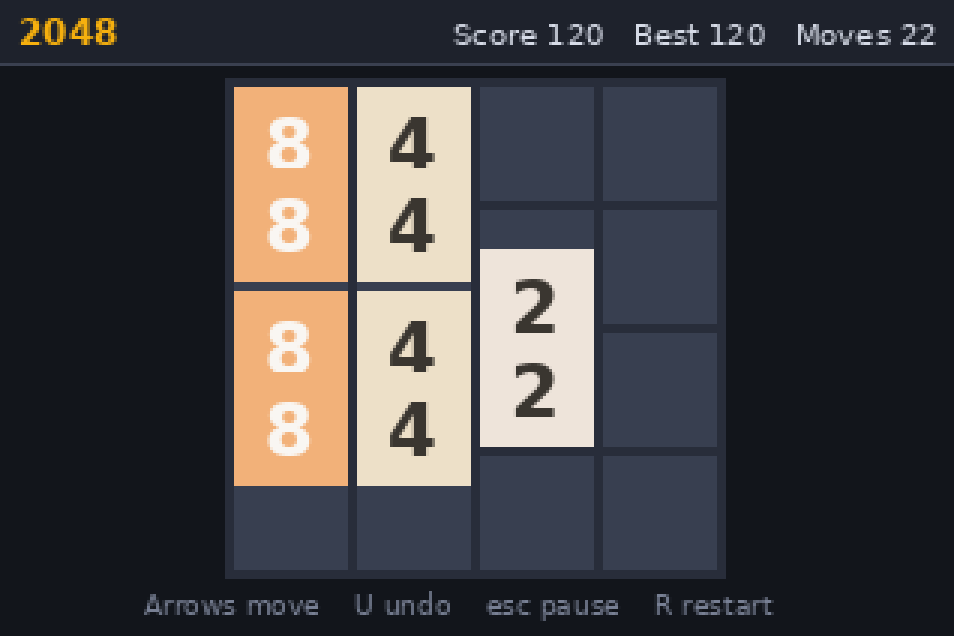

Being turn-based, it runs no game loop: the screen repaints when you press a
key and not otherwise. The timer has exactly one job — sliding tiles to their
new cells — and only asks for repaints while a slide is actually on screen.

## Connect Four

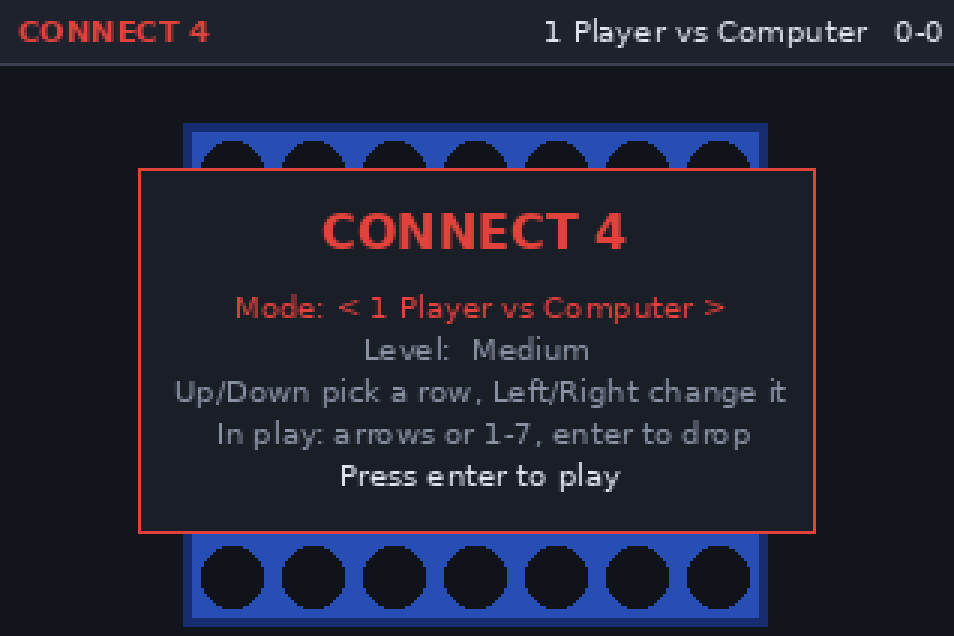
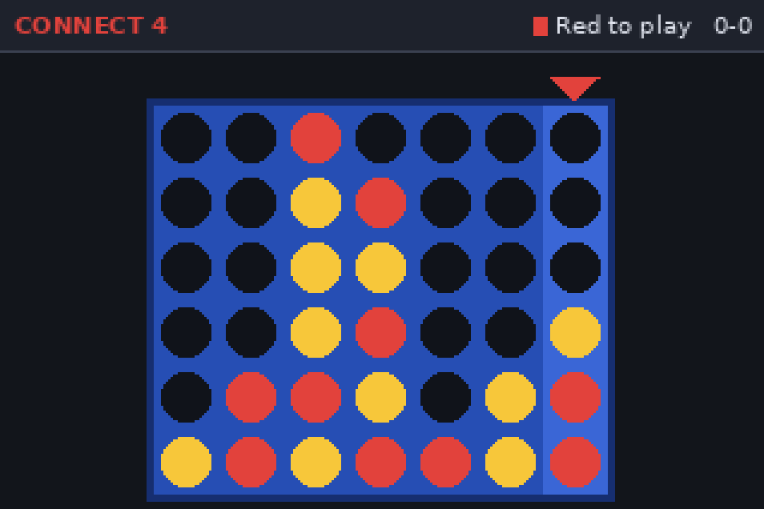

Two players on one calculator, or one player against a bot with four
difficulties.

| Key | Action |
| --- | --- |
| Left/right, or `A`/`D` | Move the cursor |
| `enter`, down arrow, or `S` | Drop into the cursor's column |
| `1`–`7` | Drop straight into that column |
| `esc` or `P` | Pause |
| `R` | Restart the round |
| `M` | Back to the title screen |
| Click | Drop into the column you clicked; confirm on menus |

On the title screen, up/down picks a row and left/right changes it. Red always
moves first, and who opens alternates between rounds. The match tally in the
status bar survives a restart; it resets when you go back to the menu.

"Two players" means two players **on one calculator**, taking turns. Nspire Lua
has no networking of any kind — no sockets, no link cable, no wireless — so
hot-seat is the only multiplayer there can be.

### The bot

The interesting part. There are no threads on this machine, so a search that
ran to completion inside one `on.timer()` callback would freeze the screen and
queue up keypresses for as long as it took, which to a player is
indistinguishable from a crash.

So the search never runs to completion in one go. It is an explicit state
machine over its own stack of frames — `ai:think(n)` advances it by `n` nodes
and returns either a column or "still thinking" — and `main.lua` feeds it one
slice per tick, painting a thinking indicator meanwhile. Because the search is
pure logic, the tests can drive the very same code straight through to the end
and check that slicing it changes *when* it answers and never *what* it
answers.

It searches by iterative deepening: depth 1, then 2, then 3, keeping the best
move found so far. That is what makes a budget usable — however little work the
bot was allowed, the last completed depth has already left a move behind.
Alpha-beta with centre-first ordering does the pruning; Connect Four's
branching factor is seven, and a centre disc sits in more of the 69 winning
lines than any other, so trying the middle first cuts the effective branching
hard.

Two things it deliberately does not do. It does not use bitboards, the usual
trick for this game: Lua 5.1 has no bitwise operators and the Nspire has no
`bit` library, so it is a plain array board. And it does not search the board
you are playing on — the search is suspended between ticks with several discs
still played, and painting *that* board showed phantom discs flickering in and
out while the bot thought, so it works on a copy.

Difficulty is search depth, plus deliberate blunders at Easy so a beginner can
actually win. What each level really gets is a number of ticks; the depth that
fits in them is whatever the machine can manage. The numbers behind that, and
what was measured to pick them, are in the comment above `Board.LEVELS` in
`src/connect4/game.lua`.

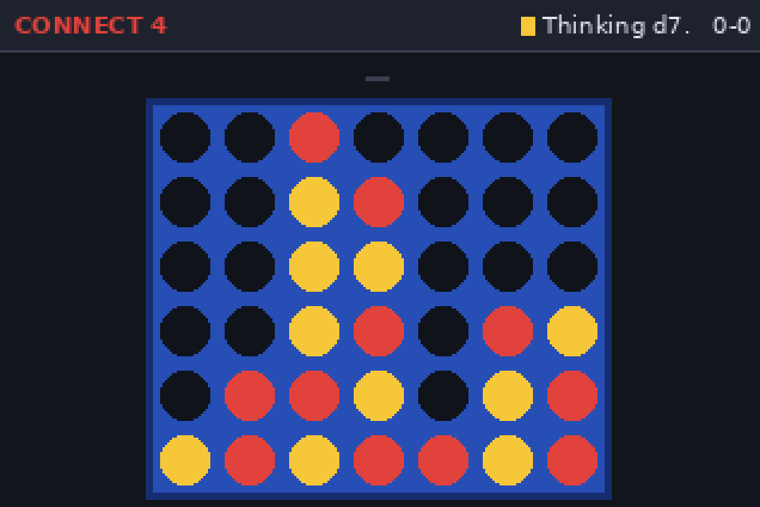
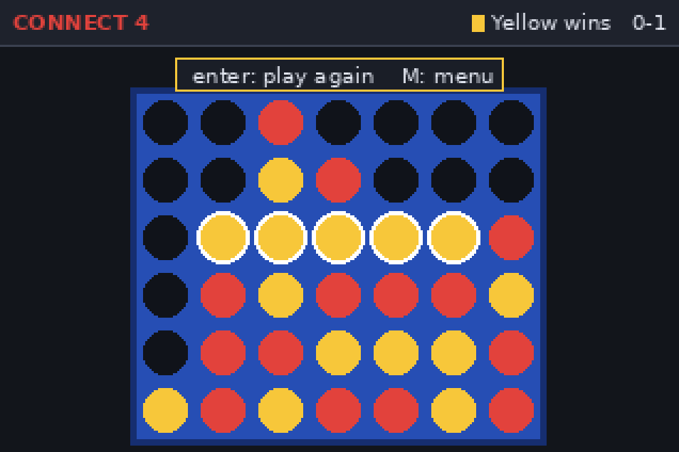

## Chess

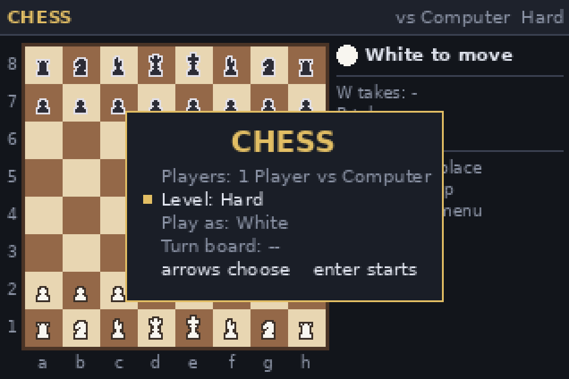
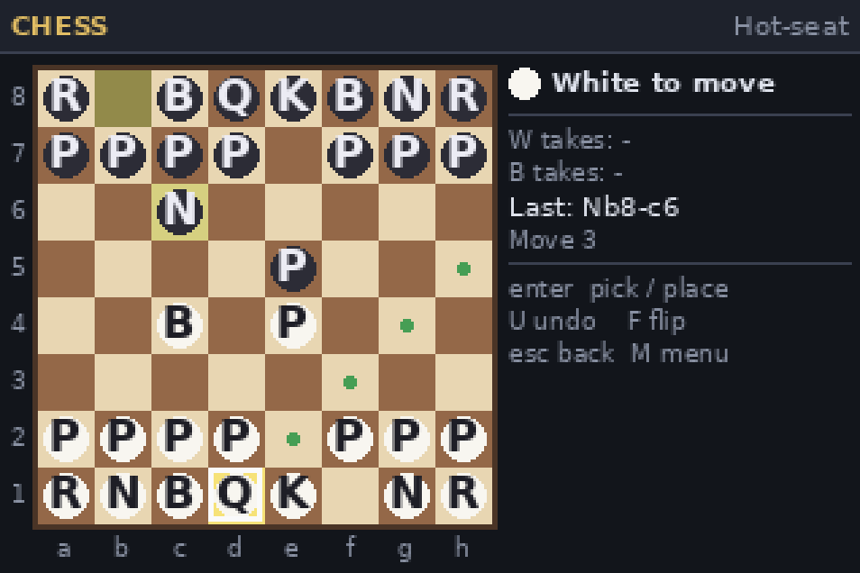

Full legal chess. Two players on one calculator, or one player against a bot
with three difficulties.

| Key | Action |
| --- | --- |
| Arrows | Move the cursor (and choose on the menu and the promotion panel) |
| `enter` | Pick a piece up, then put it down on a square |
| `esc` | Put the piece back down; again to pause; from a finished game, the menu |
| `U` | Take the last move back |
| `F` | Turn the board round |
| `R` | Restart the game |
| `M` | Back to the title screen |
| Click | Same as moving the cursor there and pressing `enter` |

Picking a piece up lights its square and marks every square it may legally go
to — a dot for a quiet move, a ring for a capture. On a board of twenty-pixel
squares that is the difference between playing and guessing. A king in check
gets its square painted red, and keeps it after mate, which is the answer to
"why is that the end".

The pieces are [Pixel Chess](https://brosen.itch.io/pixel-chess) by **brosen**,
drawn at their native 16x16 inside the 21-pixel squares. See
[Drawing the pieces](#drawing-the-pieces) for why they are not images.

Castling, en passant, promotion to any of the four pieces, checkmate,
stalemate, the fifty-move rule, threefold repetition and insufficient material
are all there. Promotion raises a chooser rather than assuming a queen:
underpromotion to a knight is the one that wins games.

"Two players" means two players **on one calculator**, taking turns. Nspire Lua
has no networking of any kind — no sockets, no link cable, no wireless — so
hot-seat is the only multiplayer there can be. Because both players are on the
same side of the screen, the menu offers to turn the board round between turns.

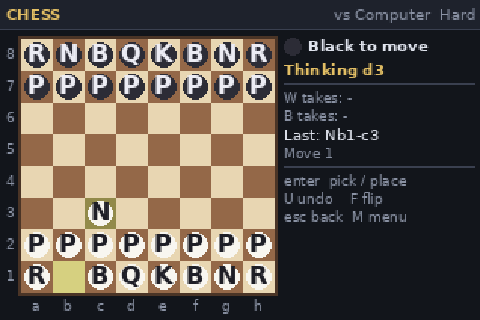
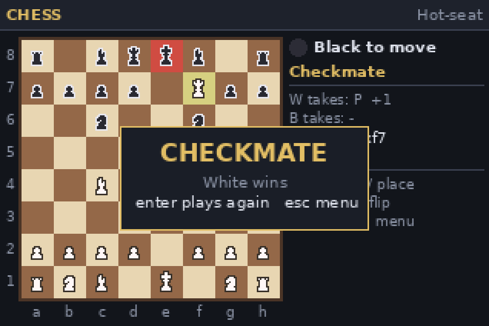

### How the rules are checked

Move generation is the whole game: get it wrong and everything above is
decoration. It is verified by **perft**, which counts the leaves of the legal
move tree to a given depth. The counts for a handful of standard positions are
published and exact, so matching them proves castling, en passant, promotion
and check evasion all at once — in combinations nobody would think to write a
test for.

| Position | Depth 1 | 2 | 3 | 4 | 5 |
| --- | --- | --- | --- | --- | --- |
| Initial | 20 | 400 | 8,902 | 197,281 | 4,865,609 |
| Kiwipete | 48 | 2,039 | 97,862 | 4,085,603 | |
| Position 3 | 14 | 191 | 2,812 | 43,238 | 674,624 |
| Position 4 | 6 | 264 | 9,467 | 422,333 | |
| Position 5 | 44 | 1,486 | 62,379 | 2,103,487 | |
| Position 6 | 46 | 2,079 | 89,890 | 3,894,594 | |

All six match. `make GAME=chess test` runs them to depth 3 (and position 3 to
5); `CHESS_SLOW=1 make GAME=chess test` runs every depth in the table, which
takes a couple of minutes because 4.8M nodes of interpreted Lua is not a unit
test.

The board is a **10x12 padded mailbox**, not bitboards and not 0x88. Lua 5.1
has no bitwise operators and the Nspire has no `bit` library, so bitboards are
out — and 64 bits does not fit exactly in a double anyway. The textbook 0x88
trick is `sq & 0x88`, which without an AND is worse than useless. The padding
makes "is that off the board?" a single array lookup, and the two border rows
at each end are what keep a knight's reach inside the array from every square.
Repetition detection, which normally wants Zobrist hashing, builds a string key
instead and counts it in a table; it happens once per played move and never
inside the search.

Moves are packed into a single integer rather than a table, and the search uses
make/unmake with an undo record rather than copying the board — a table per
node would have spent more time in the collector than in the search.

### Drawing the pieces

The Nspire can draw images — `gc:drawImage` has existed since apilevel 1.0, and
`image.new()` builds one from a binary string — but the byte layout of that
string is documented only by TI, and getting it wrong shows up on hardware as a
blank screen with nothing to debug.

These sprites do not need it. They are 1-bit masks: three colours in the whole
set (transparent, opaque white, opaque black), and the white and black files
are the *same silhouette* in two inks. So `tools/sprites.py` turns each one
into horizontal runs and the game draws them with `fillRect` — API this repo's
mock and PNG renderer already model and already test. Nothing in the shared
harness had to change to support them.

A whole 32-piece board is about 940 rects in **four** `setColorRGB` calls: the
runs are grouped rim-then-fill, per side, because setting a colour is a call
and doing it per piece would be a hundred of them. Chess repaints on input
rather than on a timer, so that is a per-keypress cost and not a per-frame one.

The rim is the part that is not in the original art — it is the 8-connected
dilation of the mask, drawn in the opposite ink. Without it a white piece on a
light square and a black piece on a dark square are both nearly invisible.

Below 16-pixel squares there is no room for a 16x16 sprite and no scaling
available, so the game falls back to letters on discs rather than cropping
them. Both paths are exercised by `tests/chess/ui.lua`, which reads pieces back
out of the painted frame either way — a sprite is identified by how many runs
it is drawn in and how many pixels they cover, a pair that is unique across the
six pieces.

Regenerate after changing the art in `assets/chess/`:

```
python3 tools/sprites.py            # rewrite the block in src/chess/main.lua
python3 tools/sprites.py --check    # exit 1 if it is out of date
```

### The bot

Same shape as Connect Four's, and for the same reason: there are no threads on
this machine, so a search that ran to completion inside one `on.timer()`
callback would freeze the screen and queue up keypresses for as long as it
took, which to a player is indistinguishable from a crash. `ai:think(n)`
advances an explicit state machine by `n` nodes and answers either with a move
or "still thinking"; `main.lua` feeds it one slice per tick and paints an
indicator. Because the search is pure logic, the tests drive the very same code
straight through and check that slicing changes *when* it answers and never
*what*.

Iterative deepening with alpha-beta, captures first by MVV-LVA, and a
quiescence search that extends captures only. That last one is not optional: a
two-ply search without it stops in the middle of an exchange and counts the
half that went its way, so it hangs pieces constantly. There is a test for
exactly that — the same position, with and without.

Evaluation is material plus piece-square tables, kept as a running total by
make/unmake so a leaf costs one field read.

**Depth is honestly two to three ply**, plus quiescence. That is what
interpreted Lua on a 396 MHz ARM supports, and the bot is built for it: it
plays legal, sensible chess and punishes a hanging piece. It does not play
well, and is not meant to.

So difficulty comes from move **selection**, not depth — there is no room left
to search less. Every level searches about as deeply as it can, then picks from
the scored root moves with a temperature-weighted softmax: at temperature zero
that is the best move, and as it rises, moves within a pawn or two start to
come up. Easy plays plausible moves that are merely not the best ones, which is
a very different thing from "a random move with probability p" — uniform
blunders are instantly recognisable as a computer throwing a game away.

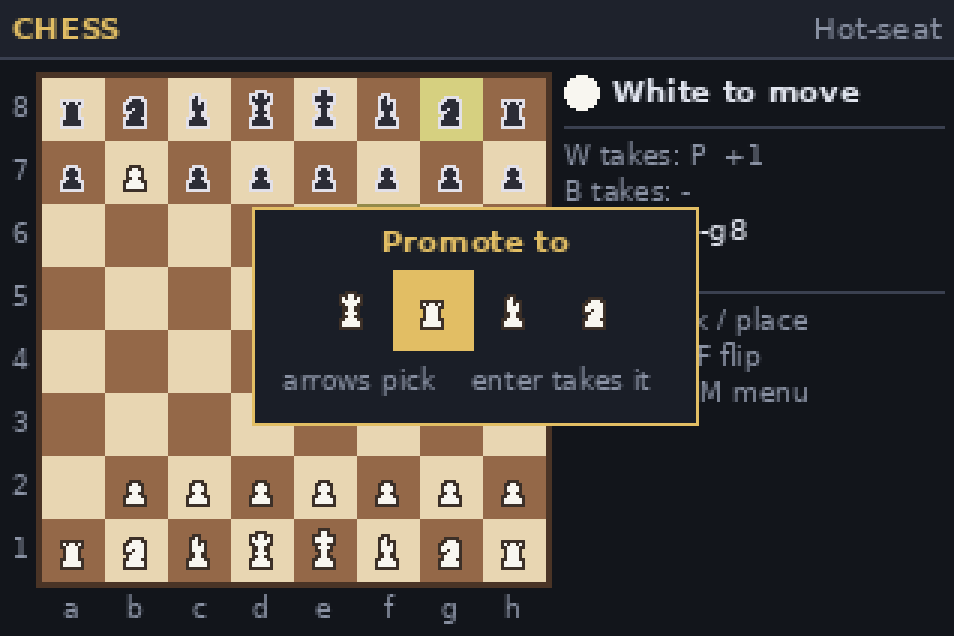

Snake, Flappy and 2048 keep high scores for the session, and Connect Four
keeps a match tally. They reset when you close the document, because writing
one back would mean saving the document on every death. Chess keeps nothing
between games, but `U` will walk a game back move by move for as long as you
have the patience.

## Wordle

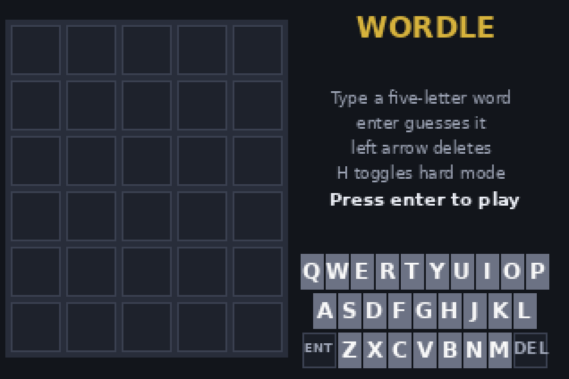
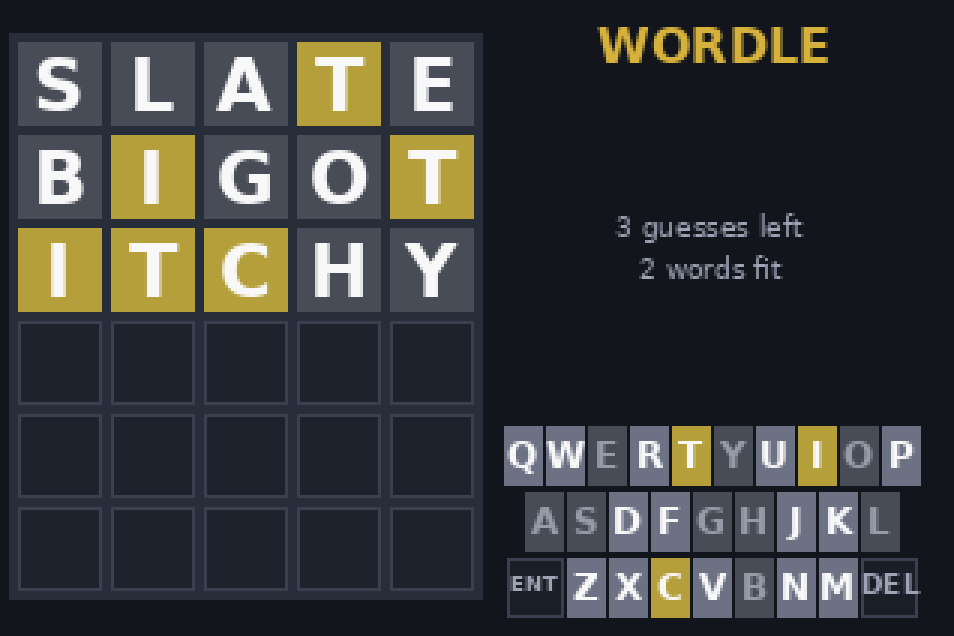

| Key | Action |
| --- | --- |
| Letter keys | Type into the current row |
| `enter`, or space | Guess the word; start or restart between games |
| Left arrow, or `del` | Delete a letter |
| `esc` | Clear the whole row |
| `H` | Toggle hard mode (title screen only) |
| Click | Tap the on-screen keyboard, including `ENT` and `DEL` |

Six goes at a five-letter word. Green means right letter, right place; yellow
means right letter, wrong place; grey means the letter is not there.

This is the one game here where the calculator's keyboard is used as a
keyboard, which suits the hardware better than anything needing a *held* key —
there is no key-down polling and no key-up event on the Nspire, so a held key
routes through OS auto-repeat and feels laggy. Typing is discrete by nature, so
it feels the same as it does anywhere else.

Deleting is bound twice on purpose. `on.backspaceKey` is not in every Nspire OS
build, so the left arrow deletes as well; whichever handler the runtime
actually calls, the player can take a letter back.

### The colouring rule, which is the whole game

The naive check — "is this letter somewhere in the answer?" — is wrong, and
it is wrong in the case that comes up constantly. Guess **SPEED** against
answer **ABIDE** and it paints both E's, telling you there are two E's when
there is one.

The rule is a two-pass multiset algorithm:

1. Mark every position where the letters match green, and **remove those
   letters from a pool** initialised to the answer's letters.
2. Walk left to right over what is left. If the guessed letter is still in the
   pool, mark it yellow and take one from the pool; otherwise mark it grey.

Greens claim their letters before any yellow is assigned — *including greens
further right than the yellow candidate*. Guess **LOLLY** against answer
**ALLOW**: the third L matches, so only one of the answer's two L's is left,
the first L takes it, and the fourth L gets nothing. `YYGBB`.

### Proving it

Cases are not enough here, so the rule is pinned by properties over thousands
of pairs drawn from the real word list — the same role perft plays for the
chess move generator. Five of them, which together leave the answer no freedom
at all:

- for every letter, greens + yellows = `min(count in guess, count in answer)`
- a position is green if and only if the letters match
- among positions competing for one scarce letter, the leftmost gets the yellow
- `score(w, w)` is all green, for every word in the list
- the multiset of non-grey letters is the same whichever word you call the answer

Hand-written cases then sit underneath as regression anchors, each derived in
the test file's comments rather than recalled. That is not pedantry: the first
draft of the hard-mode duplicate test used **WEDGE**, which fails for the wrong
reason — its `D` breaks a green *position* rule before the duplicate rule is
ever reached. The comment now says so.

`tests/wordle/run.lua` also runs a solver over all 2,315 answers and prints the
distribution. It asserts nothing about quality — it is there because playing
two thousand complete games is a far harder workout for the scoring function
than any case anyone would write by hand.

### Fitting it on the screen

318x212 is tighter than it sounds. A 5x6 grid, a three-row keyboard and a
status line stacked vertically force the tiles down to about 18 pixels. But the
screen is landscape and Wordle's layout is portrait, so they go **side by
side** instead: the grid takes 152x183 at 28-pixel tiles, and the 146 pixels
left over hold ten 13-pixel keys per row with room to spare.

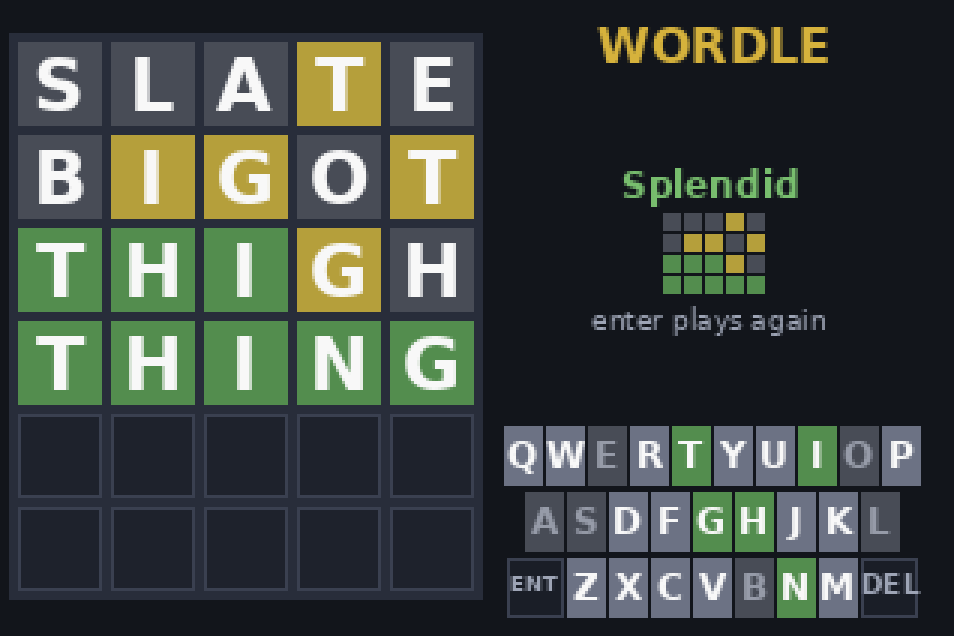
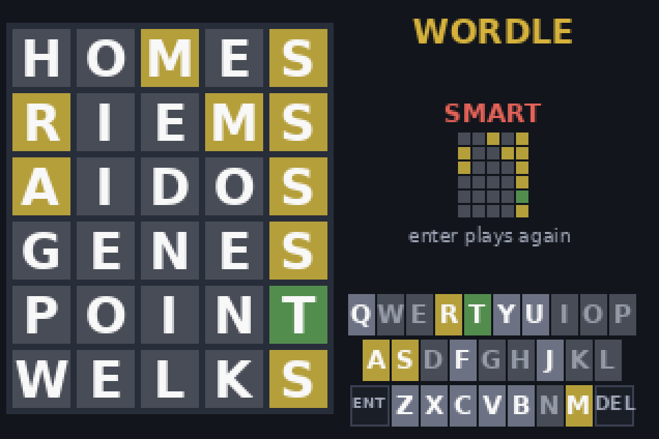

The keyboard is not decoration — it is where the per-letter state lives, and
that state is most of the game's feedback. A letter only ever moves *up* the
scale, grey to yellow to green, never back, which falls out of storing the mark
as an ordered number and keeping the maximum. It also updates only once a row
has finished turning over, so a letter never goes green before the tile that
earned it.

Under the count of guesses left is the number of answers still consistent with
everything shown. Filtering 2,315 words is not free on a 396MHz ARM, and there
are no threads and no way to yield, so it is a state machine the timer advances
one slice per tick — the same shape as Connect Four's search. The pass builds a
new list and swaps it in only when it finishes, so a repaint can never catch it
half-done. A test drives it at budgets from 1 to 100,000 and checks the answer
is identical every time: slicing changes *when* it answers, never *what*.

Hard mode makes revealed hints compulsory, and the duplicate semantics are the
fiddly part. A green pins its square. A yellow only promises the letter appears
*somewhere* — but a row showing the same letter non-grey twice has promised it
appears twice, so the obligation is a count, taken as the maximum across rows
rather than the sum: two rows each showing one E prove there is one E, not two.

### 13,732 words inside the document

There is no file I/O in the sandbox, so the dictionary travels inside the
`.tns`. Both lists are one long Lua string, one word per line, binary-searched
with `string.sub` — about 14 steps over 11,417 guesses. Three shapes were
measured before picking that one:

| | source | `.tns` | parse |
| --- | --- | --- | --- |
| one word per line, 6 bytes each | 68,523 | 29,638 | 0.3 ms |
| packed 5 bytes per word | 57,835 | 28,012 | 0.2 ms |
| base-26 integers in a table | 90,198 | 33,233 | 3.2 ms |

The integer table loses on every axis at once — half again the source, a fifth
more `.tns`, and ten times the parse cost, which on the handheld is a visible
pause at launch. That 26^5 fits exactly in a double is true and irrelevant.
Packing to five bytes saves 1.6 KB; the readable form was worth more than that,
because a dictionary you can `grep` and review in a diff is one where a bad
entry gets noticed.

Bitwise tricks are out anyway: this is Lua 5.1 with no `bit` library on the
Nspire, so no letter-presence masks. Plain arithmetic and a 26-element array.

## Installing

1. Connect the calculator over USB. On a Mac the easiest route is
   [TI-Nspire CX II Connect](https://nspireconnect.ti.com) — free, web-based,
   nothing to install, but it **requires Chrome**; Safari has no WebUSB and
   will fail in a way that looks like a hardware fault. TI-Nspire Student or
   Teacher Software works too.
2. Drag `Snake.tns`, `Flappy.tns`, `2048.tns`, `Connect4.tns`, `Chess.tns` or
   `Wordle.tns` into the calculator's file list. They must land in **My Documents** directly, not a
   subfolder.
3. On the handheld, open **My Documents**, pick one, and press `enter`.

There is nothing else to install. Each `.tns` is a normal TI-Nspire document
that happens to contain a Lua script, so the OS runs it in its built-in
sandbox exactly like a TI-authored one.

Requires OS 3.0.2 or newer, which every CX II ships with.

## Building it yourself

You only need this if you want to change a game; the committed `.tns` files
are ready to use.

```
make GAME=snake                # build Snake.tns   (GAME defaults to snake)
make GAME=flappy               # build Flappy.tns
make GAME=2048                 # build 2048.tns
make GAME=connect4             # build Connect4.tns
make GAME=chess                # build Chess.tns
make GAME=wordle               # build Wordle.tns
make GAME=flappy test          # that game's logic + runtime tests
make GAME=flappy screenshots   # preview PNGs -> build/flappy/screenshots
make all-games                 # build everything under src/
make list                      # list games
make clean
```

Requirements:

- **[luna](https://github.com/ndless-nspire/luna)** on your `PATH` — the
  open-source Lua-to-`.tns` converter. Clone it, `make`, and copy the binary
  somewhere on your path. It needs zlib (`zlib1g-dev` / `zlib-devel`).
- **python3** for the bundler.
- **Lua 5.1** for the tests (optional, but you want it).
- **Pillow** (`pip install Pillow`) for `make screenshots` (optional).

If you'd rather not build anything, paste `build/<game>/<game>.lua` into the
Student Software's script editor (**Insert > Script Editor**) and save the
document from there — same result, more clicking.

## How it's laid out

```
src/<game>/game.lua       rules -- pure Lua, no calculator APIs
src/<game>/main.lua       drawing, input and timing for the Nspire
assets/<game>/            source art, where a game has any
tests/<game>/run.lua      logic tests
tests/<game>/frame.lua    reads a game's state back out of a painted frame
tests/<game>/ui.lua       game-specific frame assertions
tests/<game>/autoplay.lua plays itself, for screenshots

tests/nspire_stub.lua     shared: mock of the Nspire runtime
tests/run_ui.lua          shared: game-agnostic runtime tests
tools/                    shared: bundler, frame capture, PNG renderer
tools/sprites.py          chess only: piece art -> Lua run-length spans
tools/wordlist.py         wordle only: word lists -> a Lua string to search
build/<game>/<game>.lua   generated: the script that goes into the .tns
<Game>.tns                generated: the file you copy to the calculator
```

The harness is shared between games; only the files under `src/<game>/` and
`tests/<game>/` are per-game. `CLAUDE.md` has the details for adding another.

The logic/presentation split matters more than it looks. `game.lua` touches no
`platform`, `gc`, or `timer`, so the rules run under a desktop Lua and can be
tested directly. Everything calculator-shaped lives in `main.lua`.

The handheld has no `require`, so `tools/bundle.py` inlines the logic module
into a single file and puts `platform.apilevel` on line 1, where the OS looks
for it.

## Testing without a calculator

Dragging a `.tns` over USB for every change gets old fast. Three options,
roughly in order of how quickly they catch things:

**`make GAME=<game> test`** — two suites, no calculator involved.
`tests/<game>/run.lua` covers the rules: for Snake, turn queueing, the
tail-follow exception, food placement on a nearly-full board and the win
condition; for Flappy, the physics and the reachability of every generated
gap; for 2048, the merge rules where all the bugs live — merge-once-per-move,
merge order by direction, what makes a move legal, and game over as "no
direction changes the board" rather than "the board is full". All of them end
with a fuzz pass checking structural invariants over thousands of steps.

Connect Four has unusually strong testable properties, and its suite leans on
them. Win detection is checked in all four directions at every position on the
board, and — because the game only ever looks at lines through the last disc
played — against a full-board scan after every move of twelve hundred random
games. The pruned search is checked against a slow, obviously-correct minimax
written inside the test file: over many random positions, at the same depth,
alpha-beta has to pick a move of equal value. The sliced search is checked
against the same search run in one shot, node for node. And the bot plays
fuzz matches against a random player, which it must essentially never lose.

Between them those caught two bugs that no amount of reading would have: the
search left its discs on the board when a budget ran out part-way, and the
board being painted was the board being searched.

Chess is checked the same way and then some. Perft is the centre of it — see
the table above — because a rule test can only be as good as the case someone
thought to write, while perft counts every leaf of the whole move tree against
a number the outside world already knows. On top of that: castling rejected out
of, through and into check but *not* when only b1 is attacked, which is the
half of that rule usually got wrong; en passant legal only on the move right
after the double push, and rejected when taking would uncover the king; every
drawing rule; the pruned search against a plain negamax written in the test
file; the sliced search against the one-shot, node for node; and mate-in-one
and mate-in-two positions, each proved to be one by a brute-force prover in the
test before the bot is asked to find it. That last habit caught two of the
author's own "mate in one" positions being nothing of the sort.

`tests/run_ui.lua` loads the *actual bundled script* against
`tests/nspire_stub.lua`, a mock of the calculator's runtime that is
deliberately stricter than the real one: it rejects colours outside 0–255,
unsupported font sizes, bad anchors, and negative rectangles. The Nspire
ignores a malformed drawing call silently, which on hardware shows up as "the
screen looks wrong" with nothing to debug — the mock turns that into a failing
test instead. Each game adds its own frame assertions in `tests/<game>/ui.lua`.

**`make GAME=<game> screenshots`** — plays the game through the mock and
rasterizes real frames to PNG at the handheld's true 318x212, so you can see a
layout change without leaving the terminal. The simulated player reads the
world back out of the paint calls rather than reaching into the game's
internals, so no test-only hooks leak into the shipped script.

**An emulator** — [Firebird](https://github.com/nspire-emus/firebird) runs
CX II images and opens `.tns` files directly, with a Lua console for live
poking. This is the last check before real hardware. It needs a boot image and
OS dumped from a calculator you own.

## Credits

The chess pieces are [Pixel Chess](https://brosen.itch.io/pixel-chess) by
**brosen**, used under the pack's own terms. The source PNGs are kept in
`assets/chess/` exactly as published; `tools/sprites.py` is what turns them
into something a calculator can draw.

Wordle's accepted-guess list is **SCOWL** (Spell Checker Oriented Word Lists),
Copyright 2000-2011 Kevin Atkinson, taken from Debian's `wamerican-huge`
package and filtered to five letters. SCOWL's terms are permissive and ask that
the notice travel with the words, so it does: `assets/wordle/SCOWL-COPYRIGHT.txt`.

The answer list came from the original Wordle's JavaScript bundle and carries
**no stated licence** — see `assets/wordle/README.md`, which says so plainly
rather than pretending otherwise. Swapping in a different list is one file and
one command.

Everything else here is original.

## What isn't verified

The tests and screenshots run against a *model* of the calculator, not the
calculator. Two things only real hardware can settle:

- **Font metrics.** The mock measures text with DejaVu; the Nspire has its own
  font. The layout code always asks the device's own `getStringWidth` at
  runtime, so boxes size themselves correctly either way, and the HUD drops its
  title rather than letting a long score collide with it. But the preview
  images are representative, not exact.
- **Bot speed.** How many search nodes a second the handheld manages is the
  one number in Connect Four and Chess that is an estimate rather than a
  measurement —
  the container the tests run on is an x86 desktop. The design does not depend
  on getting it right: the bot's turn is capped in *ticks*, and iterative
  deepening means a slower machine simply plays a shallower search rather than
  hanging. If your calculator is slower than assumed, the bot is a little
  weaker; if it is faster, the bot finishes early and the node budget takes
  over.
- **Timer pacing.** Snake and Flappy run a fixed 0.05 s timer and count ticks
  rather than restarting the timer at new intervals, because granularity varies
  between Nspire OS versions. If your handheld's timer is coarser than 0.05 s
  they run proportionally slower — they won't misbehave, but Snake's top speeds
  may not be reachable, and Flappy will feel heavier than intended. 2048 is
  unaffected: it is turn-based, and a coarse timer only makes its slide
  animation longer, and Connect Four and Chess only spend longer on the bot's
  turn.
- **Whether `fillRect` is fast enough for the pieces.** A full board is ~940
  rects per repaint. On this container that is imperceptible, and chess only
  repaints when you press a key, but the handheld is the one that has to draw
  them. If it turns out too slow the fix is cheap — drop the rim and fall back
  to the plain silhouettes, which is 336 rects.
- **Whether the font has chess glyphs.** It is not verified that the Nspire's
  font carries U+2654–U+265F, and a missing glyph on this OS is a silent empty
  box — which across sixty-four squares would be unreadable rather than merely
  ugly. Chess never tries: pieces are sprites, and the small-window fallback is
  plain Latin letters.
