# Snake, Flappy Bird, 2048, Connect Four, Chess, Wordle, Klondike, Slide and Fruits for the TI-Nspire CX II

Nine games written in TI-Nspire Lua. They install by drag-and-drop — no
Ndless, no jailbreak, no root.

**Grab [`Snake.tns`](Snake.tns), [`Flappy.tns`](Flappy.tns),
[`2048.tns`](2048.tns), [`Connect4.tns`](Connect4.tns),
[`Chess.tns`](Chess.tns), [`Wordle.tns`](Wordle.tns),
[`Klondike.tns`](Klondike.tns), [`Slide.tns`](Slide.tns) or
[`Fruits.tns`](Fruits.tns) and copy it onto your calculator.**

## Snake


| Key | Action |
| --- | --- |
| Arrows, `2`/`4`/`6`/`8`, or `WASD` | Steer |
| `enter` or space | Start, resume, play again |
| `esc` or `P` | Pause |
| `R` | Restart |
| `M` | Toggle solid walls vs. wrap-around (between rounds) |
| Click | Steer toward the click; confirm on menus |

Apples are worth `10 x level`. Every 4 apples raises the level and the snake
speeds up, to a cap at level 10. Following your own tail is legal — the cell
your tail is leaving this move is safe to enter. Fill the whole board and you
win.

## Flappy Bird


| Key | Action |
| --- | --- |
| `enter`, space, up arrow, `W`, `8`, `F`, or click | Flap |
| `esc`, `P`, or down arrow | Pause |
| `R` | Restart |

One tap per gap. The bird only ever goes up when you tell it to, and the flap
*sets* its speed rather than adding to it, so a tap out of a long dive lifts
exactly as much as a tap from a hover — panicking works. Each pipe cleared is
a point, and the gap tightens every 5 pipes down to a floor it never goes
below.

The pipe course is generated so that **every gap is reachable from the one
before it**. Dealt at random, a low gap followed by a high one is simply
impossible past some distance, and you lose to the generator instead of to
your own thumbs. Instead the generator is fenced by the physics: it asks how
far the bird can actually climb in the frames between two pipes, given the
gravity and flap strength in force, and never places a gap outside that. See
`src/flappy/game.lua` — and `tests/flappy/run.lua`, which checks the property
three ways: the arithmetic of the band, the courses actually produced, and a
deliberately crude autopilot that has to fly them.

## 2048


| Key | Action |
| --- | --- |
| Arrows, `2`/`4`/`6`/`8`, or `WASD` | Slide the board |
| `enter` or space | Start, resume, keep going past 2048, play again |
| `esc` or `P` | Pause |
| `U` or `backspace` | Undo one move |
| `R` | Restart |
| Click | Slide toward the side of the board you clicked |

Slide the whole board at once; equal tiles that collide merge into their sum,
and the score goes up by whatever each merge produced. A tile that has just
merged is spent for the rest of that move, which is why a row of `4 4 4 4`
becomes `8 8` and never `16`. Which pair merges first depends on the direction
you pushed: `4 4 4` gives `8 4` going left, but `4 8` going right.

A move only counts if it changes something. Push against a wall nothing can
move toward and nothing happens — no new tile, no score, and the turn is not
spent. After every move that *did* change the board, a new `2` (or, one time in
ten, a `4`) appears on a uniformly chosen empty cell.

The round ends when **no** direction would change the board, which is not the
same as the board being full — a full board with two equal neighbours still has
a move in it. `U` or `backspace` undoes one move, the one that ended the round
included, which is worth having when a mis-keyed arrow costs you the game.


Being turn-based, it runs no game loop: the screen repaints when you press a
key and not otherwise. The timer has exactly one job — sliding tiles to their
new cells — and only asks for repaints while a slide is actually on screen.

## Connect Four


Two players on one calculator, or one player against a bot with four
difficulties.

| Key | Action |
| --- | --- |
| Left/right, or `A`/`D` | Move the cursor |
| `enter`, down arrow, or `S` | Drop into the cursor's column |
| `1`–`7` | Drop straight into that column |
| `esc` or `P` | Pause |
| `R` | Restart the round |
| `M` | Back to the title screen |
| Click | Drop into the column you clicked; confirm on menus |

On the title screen, up/down picks a row and left/right changes it. Red always
moves first, and who opens alternates between rounds. The match tally in the
status bar survives a restart; it resets when you go back to the menu.

"Two players" means two players **on one calculator**, taking turns. Nspire Lua
has no networking of any kind — no sockets, no link cable, no wireless — so
hot-seat is the only multiplayer there can be.

### The bot

The interesting part. There are no threads on this machine, so a search that
ran to completion inside one `on.timer()` callback would freeze the screen and
queue up keypresses for as long as it took, which to a player is
indistinguishable from a crash.

So the search never runs to completion in one go. It is an explicit state
machine over its own stack of frames — `ai:think(n)` advances it by `n` nodes
and returns either a column or "still thinking" — and `main.lua` feeds it one
slice per tick, painting a thinking indicator meanwhile. Because the search is
pure logic, the tests can drive the very same code straight through to the end
and check that slicing it changes *when* it answers and never *what* it
answers.

It searches by iterative deepening: depth 1, then 2, then 3, keeping the best
move found so far. That is what makes a budget usable — however little work the
bot was allowed, the last completed depth has already left a move behind.
Alpha-beta with centre-first ordering does the pruning; Connect Four's
branching factor is seven, and a centre disc sits in more of the 69 winning
lines than any other, so trying the middle first cuts the effective branching
hard.

Two things it deliberately does not do. It does not use bitboards, the usual
trick for this game: Lua 5.1 has no bitwise operators and the Nspire has no
`bit` library, so it is a plain array board. And it does not search the board
you are playing on — the search is suspended between ticks with several discs
still played, and painting *that* board showed phantom discs flickering in and
out while the bot thought, so it works on a copy.

Difficulty is search depth, plus deliberate blunders at Easy so a beginner can
actually win. What each level really gets is a number of ticks; the depth that
fits in them is whatever the machine can manage. The numbers behind that, and
what was measured to pick them, are in the comment above `Board.LEVELS` in
`src/connect4/game.lua`.


## Chess


Full legal chess. Two players on one calculator, or one player against a bot
with three difficulties.

| Key | Action |
| --- | --- |
| Arrows | Move the cursor (and choose on the menu and the promotion panel) |
| `enter` | Pick a piece up, then put it down on a square |
| `esc` | Put the piece back down; again to pause; from a finished game, the menu |
| `U` | Take the last move back |
| `F` | Turn the board round |
| `R` | Restart the game |
| `M` | Back to the title screen |
| Click | Same as moving the cursor there and pressing `enter` |

Picking a piece up lights its square and marks every square it may legally go
to — a dot for a quiet move, a ring for a capture. On a board of twenty-pixel
squares that is the difference between playing and guessing. A king in check
gets its square painted red, and keeps it after mate, which is the answer to
"why is that the end".

The pieces are [Pixel Chess](https://brosen.itch.io/pixel-chess) by **brosen**,
drawn at their native 16x16 inside the 21-pixel squares. See
[Drawing the pieces](#drawing-the-pieces) for why they are not images.

Castling, en passant, promotion to any of the four pieces, checkmate,
stalemate, the fifty-move rule, threefold repetition and insufficient material
are all there. Promotion raises a chooser rather than assuming a queen:
underpromotion to a knight is the one that wins games.

"Two players" means two players **on one calculator**, taking turns. Nspire Lua
has no networking of any kind — no sockets, no link cable, no wireless — so
hot-seat is the only multiplayer there can be. Because both players are on the
same side of the screen, the menu offers to turn the board round between turns.


### How the rules are checked

Move generation is the whole game: get it wrong and everything above is
decoration. It is verified by **perft**, which counts the leaves of the legal
move tree to a given depth. The counts for a handful of standard positions are
published and exact, so matching them proves castling, en passant, promotion
and check evasion all at once — in combinations nobody would think to write a
test for.

| Position | Depth 1 | 2 | 3 | 4 | 5 |
| --- | --- | --- | --- | --- | --- |
| Initial | 20 | 400 | 8,902 | 197,281 | 4,865,609 |
| Kiwipete | 48 | 2,039 | 97,862 | 4,085,603 | |
| Position 3 | 14 | 191 | 2,812 | 43,238 | 674,624 |
| Position 4 | 6 | 264 | 9,467 | 422,333 | |
| Position 5 | 44 | 1,486 | 62,379 | 2,103,487 | |
| Position 6 | 46 | 2,079 | 89,890 | 3,894,594 | |

All six match. `make GAME=chess test` runs them to depth 3 (and position 3 to
5); `CHESS_SLOW=1 make GAME=chess test` runs every depth in the table, which
takes a couple of minutes because 4.8M nodes of interpreted Lua is not a unit
test.

The board is a **10x12 padded mailbox**, not bitboards and not 0x88. Lua 5.1
has no bitwise operators and the Nspire has no `bit` library, so bitboards are
out — and 64 bits does not fit exactly in a double anyway. The textbook 0x88
trick is `sq & 0x88`, which without an AND is worse than useless. The padding
makes "is that off the board?" a single array lookup, and the two border rows
at each end are what keep a knight's reach inside the array from every square.
Repetition detection, which normally wants Zobrist hashing, builds a string key
instead and counts it in a table; it happens once per played move and never
inside the search.

Moves are packed into a single integer rather than a table, and the search uses
make/unmake with an undo record rather than copying the board — a table per
node would have spent more time in the collector than in the search.

### Drawing the pieces

The Nspire can draw images — `gc:drawImage` has existed since apilevel 1.0, and
`image.new()` builds one from a binary string — but the byte layout of that
string is documented only by TI, and getting it wrong shows up on hardware as a
blank screen with nothing to debug.

These sprites do not need it. They are 1-bit masks: three colours in the whole
set (transparent, opaque white, opaque black), and the white and black files
are the *same silhouette* in two inks. So `tools/sprites.py` turns each one
into horizontal runs and the game draws them with `fillRect` — API this repo's
mock and PNG renderer already model and already test. Nothing in the shared
harness had to change to support them.

A whole 32-piece board is about 940 rects in **four** `setColorRGB` calls: the
runs are grouped rim-then-fill, per side, because setting a colour is a call
and doing it per piece would be a hundred of them. Chess repaints on input
rather than on a timer, so that is a per-keypress cost and not a per-frame one.

The rim is the part that is not in the original art — it is the 8-connected
dilation of the mask, drawn in the opposite ink. Without it a white piece on a
light square and a black piece on a dark square are both nearly invisible.

Below 16-pixel squares there is no room for a 16x16 sprite and no scaling
available, so the game falls back to letters on discs rather than cropping
them. Both paths are exercised by `tests/chess/ui.lua`, which reads pieces back
out of the painted frame either way — a sprite is identified by how many runs
it is drawn in and how many pixels they cover, a pair that is unique across the
six pieces.

Regenerate after changing the art in `assets/chess/`:

```
python3 tools/sprites.py            # rewrite the block in src/chess/main.lua
python3 tools/sprites.py --check    # exit 1 if it is out of date
```

### The bot

Same shape as Connect Four's, and for the same reason: there are no threads on
this machine, so a search that ran to completion inside one `on.timer()`
callback would freeze the screen and queue up keypresses for as long as it
took, which to a player is indistinguishable from a crash. `ai:think(n)`
advances an explicit state machine by `n` nodes and answers either with a move
or "still thinking"; `main.lua` feeds it one slice per tick and paints an
indicator. Because the search is pure logic, the tests drive the very same code
straight through and check that slicing changes *when* it answers and never
*what*.

Iterative deepening with alpha-beta, captures first by MVV-LVA, and a
quiescence search that extends captures only. That last one is not optional: a
two-ply search without it stops in the middle of an exchange and counts the
half that went its way, so it hangs pieces constantly. There is a test for
exactly that — the same position, with and without.

Evaluation is material plus piece-square tables, kept as a running total by
make/unmake so a leaf costs one field read.

**Depth is honestly two to three ply**, plus quiescence. That is what
interpreted Lua on a 396 MHz ARM supports, and the bot is built for it: it
plays legal, sensible chess and punishes a hanging piece. It does not play
well, and is not meant to.

So difficulty comes from move **selection**, not depth — there is no room left
to search less. Every level searches about as deeply as it can, then picks from
the scored root moves with a temperature-weighted softmax: at temperature zero
that is the best move, and as it rises, moves within a pawn or two start to
come up. Easy plays plausible moves that are merely not the best ones, which is
a very different thing from "a random move with probability p" — uniform
blunders are instantly recognisable as a computer throwing a game away.


Snake, Flappy and 2048 keep high scores for the session, and Connect Four
keeps a match tally. They reset when you close the document, because writing
one back would mean saving the document on every death. Chess keeps nothing
between games, but `U` will walk a game back move by move for as long as you
have the patience.

## Wordle


| Key | Action |
| --- | --- |
| Letter keys | Type into the current row |
| `enter`, or space | Guess the word; start or restart between games |
| Left arrow, or `del` | Delete a letter |
| `esc` | Clear the whole row |
| `H` | Toggle hard mode (title screen only) |
| Click | Tap the on-screen keyboard, including `ENT` and `DEL` |

Six goes at a five-letter word. Green means right letter, right place; yellow
means right letter, wrong place; grey means the letter is not there.

This is the one game here where the calculator's keyboard is used as a
keyboard, which suits the hardware better than anything needing a *held* key —
there is no key-down polling and no key-up event on the Nspire, so a held key
routes through OS auto-repeat and feels laggy. Typing is discrete by nature, so
it feels the same as it does anywhere else.

Deleting is bound twice on purpose. `on.backspaceKey` is not in every Nspire OS
build, so the left arrow deletes as well; whichever handler the runtime
actually calls, the player can take a letter back.

### The colouring rule, which is the whole game

The naive check — "is this letter somewhere in the answer?" — is wrong, and
it is wrong in the case that comes up constantly. Guess **SPEED** against
answer **ABIDE** and it paints both E's, telling you there are two E's when
there is one.

The rule is a two-pass multiset algorithm:

1. Mark every position where the letters match green, and **remove those
   letters from a pool** initialised to the answer's letters.
2. Walk left to right over what is left. If the guessed letter is still in the
   pool, mark it yellow and take one from the pool; otherwise mark it grey.

Greens claim their letters before any yellow is assigned — *including greens
further right than the yellow candidate*. Guess **LOLLY** against answer
**ALLOW**: the third L matches, so only one of the answer's two L's is left,
the first L takes it, and the fourth L gets nothing. `YYGBB`.

### Proving it

Cases are not enough here, so the rule is pinned by properties over thousands
of pairs drawn from the real word list — the same role perft plays for the
chess move generator. Five of them, which together leave the answer no freedom
at all:

- for every letter, greens + yellows = `min(count in guess, count in answer)`
- a position is green if and only if the letters match
- among positions competing for one scarce letter, the leftmost gets the yellow
- `score(w, w)` is all green, for every word in the list
- the multiset of non-grey letters is the same whichever word you call the answer

Hand-written cases then sit underneath as regression anchors, each derived in
the test file's comments rather than recalled. That is not pedantry: the first
draft of the hard-mode duplicate test used **WEDGE**, which fails for the wrong
reason — its `D` breaks a green *position* rule before the duplicate rule is
ever reached. The comment now says so.

`tests/wordle/run.lua` also runs a solver over all 2,315 answers and prints the
distribution. It asserts nothing about quality — it is there because playing
two thousand complete games is a far harder workout for the scoring function
than any case anyone would write by hand.

### Fitting it on the screen

318x212 is tighter than it sounds. A 5x6 grid, a three-row keyboard and a
status line stacked vertically force the tiles down to about 18 pixels. But the
screen is landscape and Wordle's layout is portrait, so they go **side by
side** instead: the grid takes 152x183 at 28-pixel tiles, and the 146 pixels
left over hold ten 13-pixel keys per row with room to spare.


The keyboard is not decoration — it is where the per-letter state lives, and
that state is most of the game's feedback. A letter only ever moves *up* the
scale, grey to yellow to green, never back, which falls out of storing the mark
as an ordered number and keeping the maximum. It also updates only once a row
has finished turning over, so a letter never goes green before the tile that
earned it.

Under the count of guesses left is the number of answers still consistent with
everything shown. Filtering 2,315 words is not free on a 396MHz ARM, and there
are no threads and no way to yield, so it is a state machine the timer advances
one slice per tick — the same shape as Connect Four's search. The pass builds a
new list and swaps it in only when it finishes, so a repaint can never catch it
half-done. A test drives it at budgets from 1 to 100,000 and checks the answer
is identical every time: slicing changes *when* it answers, never *what*.

Hard mode makes revealed hints compulsory, and the duplicate semantics are the
fiddly part. A green pins its square. A yellow only promises the letter appears
*somewhere* — but a row showing the same letter non-grey twice has promised it
appears twice, so the obligation is a count, taken as the maximum across rows
rather than the sum: two rows each showing one E prove there is one E, not two.

### 13,732 words inside the document

There is no file I/O in the sandbox, so the dictionary travels inside the
`.tns`. Both lists are one long Lua string, one word per line, binary-searched
with `string.sub` — about 14 steps over 11,417 guesses. Three shapes were
measured before picking that one:

| | source | `.tns` | parse |
| --- | --- | --- | --- |
| one word per line, 6 bytes each | 68,523 | 29,638 | 0.3 ms |
| packed 5 bytes per word | 57,835 | 28,012 | 0.2 ms |
| base-26 integers in a table | 90,198 | 33,233 | 3.2 ms |

The integer table loses on every axis at once — half again the source, a fifth
more `.tns`, and ten times the parse cost, which on the handheld is a visible
pause at launch. That 26^5 fits exactly in a double is true and irrelevant.
Packing to five bytes saves 1.6 KB; the readable form was worth more than that,
because a dictionary you can `grep` and review in a diff is one where a bad
entry gets noticed.

Bitwise tricks are out anyway: this is Lua 5.1 with no `bit` library on the
Nspire, so no letter-presence masks. Plain arithmetic and a 26-element array.

## Klondike

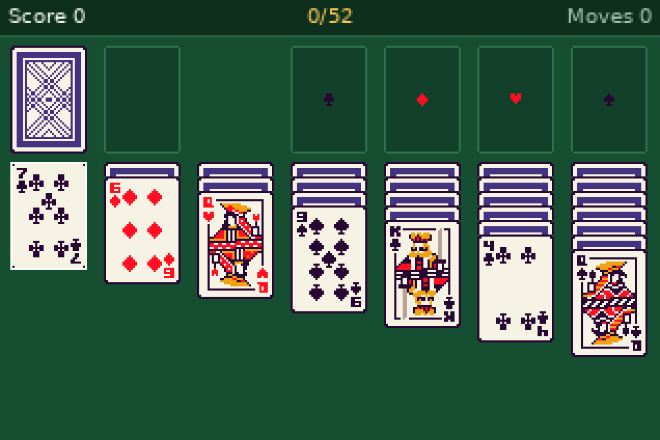
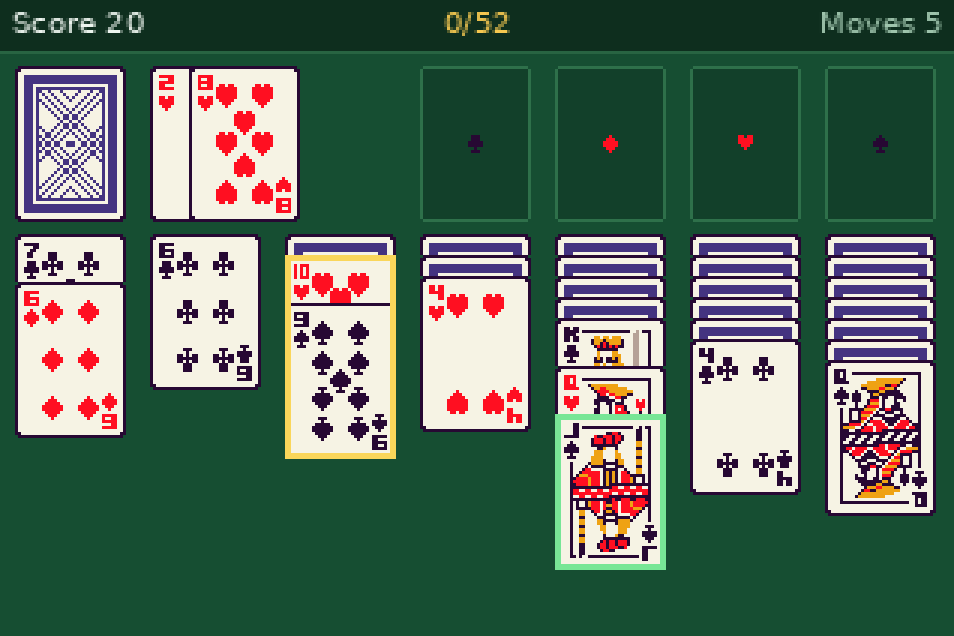

Solitaire, the one that shipped with Windows. Seven columns, four foundations,
and a stock you turn over one card or three at a time. Arrows move between
piles and up and down inside a column, `enter` picks a run up and `enter`
again puts it down, `esc` cancels. Clicking works too — a card or pile under
the point, two clicks to a move.

The menu offers **draw one or draw three**, **unlimited or three stock
passes**, and an optional autoplay that sends cards to the foundations once
they are provably safe. `U` undoes, all the way back to the deal; `R` deals
the same game again, `N` a new one.

**Every pile it can legally go to is highlighted**, not just the card you are
holding. On a 318-pixel screen that is the difference between playing and
guessing, and it is the same thing that made the chess board usable. The
highlights come from filtering the rules' own move list, so a highlighted
destination and an accepted move cannot disagree — and `tests/klondike/ui.lua`
checks that against the rules over a few hundred selections anyway.

### The deck is the invariant

Klondike's rules fit in a sentence: descending alternating colours down the
tableau, ascending same-suit from the ace up the foundations. That is not
where an implementation goes wrong. It goes wrong in the bookkeeping, so
`tests/klondike/run.lua` is almost entirely properties asserted continuously
over a fuzz of random legal play rather than scripted games:

- the union of every pile is **exactly one of each of the 52 rank/suit pairs**,
  at every single step;
- every face-up run in a column is a valid descending alternating sequence —
  something the rules must *maintain*, not merely check when offering a move;
- a column's face-down count never increases, and only ever falls by one, and
  only when the cards above it have gone;
- **make and unmake are exact inverses**, down to which cards are face-down,
  the stock/waste split, the pass count and the score;
- the generator and the validator agree **in both directions** — every move
  `legalMoves()` offers is accepted, and every move `play()` accepts was
  offered. A one-way check misses a whole class of bug.

Undo is unlimited and works by make/unmake against a small record, not a
snapshot per move. The record carries whether the move turned a face-down card
up, because an undo that leaves it face-up has handed the player information
the position never contained — and that is invisible on screen.

### Turning the waste back over

The draw-3 ordering is the one part of Klondike that is easy to get subtly
backwards while still looking right. Cards are turned onto the waste **one at
a time**, so a group of three arrives reversed: with the stock reading A, B, C
from the top, the player turns A face-up first and covers it with B and then
C, and it is C — the third card down — that ends up playable.

Recycling is the same operation run over the whole waste, which makes it the
exact inverse of drawing. That gives a property worth testing rather than
eyeballing: **draw the entire stock away, recycle, and the stock is the
identical array it started as**, so a second pass deals the same cards in the
same groups of three. A backwards recycle still counts down and still refills.
It just deals a different partition of the deck every pass, which is a
different and much easier game. The first version here had exactly that bug,
and this test is what caught it.

### Drawing the cards

The cards are 37x52 pixels of someone else's pixel art, drawn at 1:1 — pixel
art at a fractional scale is ruined pixel art, so seven columns of 37 across a
318-pixel screen is the layout, not a choice. Below about 279 pixels wide the
game says the window is too small instead of drawing a broken board.

As with the chess pieces, `gc:drawImage` is avoided: the byte layout
`image.new` wants is documented only by TI, and a wrong guess paints nothing
with no error. But a card is not a chess piece — it is mostly a solid block of
one colour. So the body is two rects, the frame (pixel-identical across all 53
sprites, and checked to be) is eight more, and only the ink left over is
run-encoded, three printable characters per run. That is about 150 runs for a
typical card and 24 KB for the whole deck. `tools/cardart.py` rebuilds every
sprite from the spans it emitted and compares against the PNG pixel for pixel,
so a card that would draw wrong on the calculator is a build failure here.

A whole frame is about 2,700 rects — Chess draws a board in 940 — but Klondike
repaints on a key press and never on a timer, so that is a per-keypress cost.

### Fanning a column

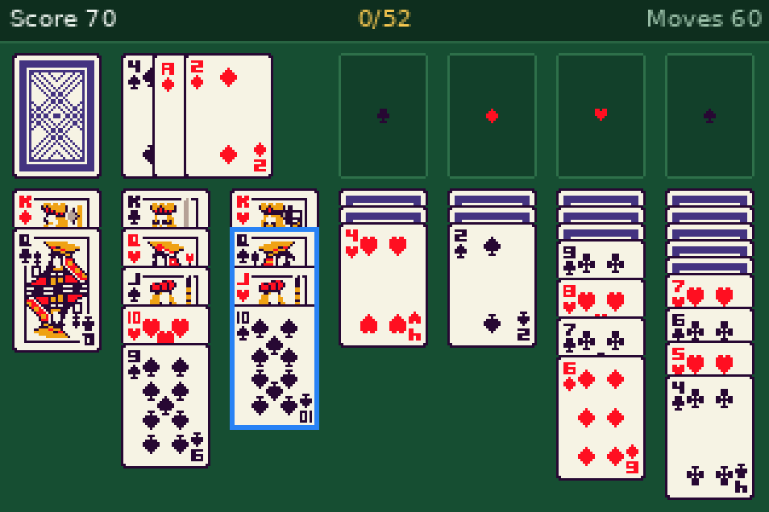
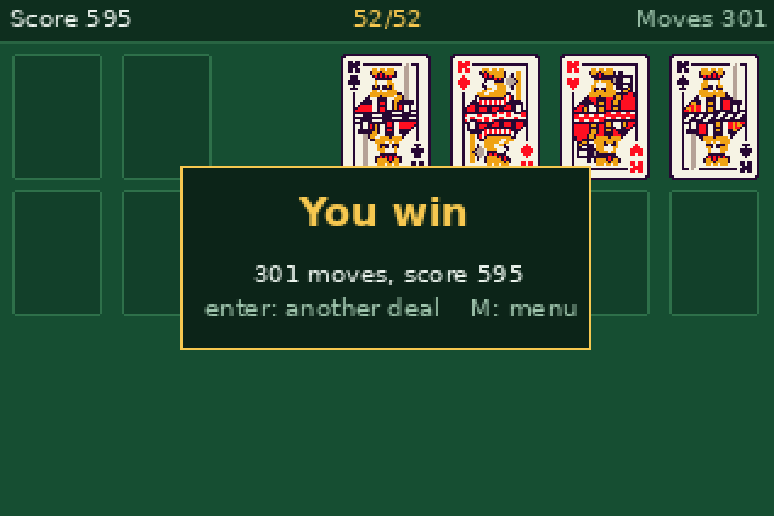

A column can reach six face-down cards under a full king-to-ace run of
thirteen. Sizing every column for that worst case would force about six pixels
on all of them and ruin the common case, so the fan is worked out **per column
at paint time** from what that column actually holds.

The art puts a rank glyph and a suit pip in the top-left corner, which is what
makes fanning possible at all: a covered card only shows its top strip, and
nine visible rows are enough for the rank, sixteen for the rank and the suit.
Art that centred a large pip with no corner index could not be fanned, and the
game would have had to draw an index over the top of it.

Room is bought by squeezing the face-down block first, one pixel at a time,
because those cards are identical backs and carry nothing. Only when that runs
out does the face-up step drop below what shows a rank. Every card is drawn
clipped to the strip a player can actually see, which is both the optimisation
and the reason the tableau can never be overrun: containment is structural,
not arithmetic.

### The solver

`tests/klondike/solver.lua` is a depth-first search with a transposition set
and a node budget. It exists for two reasons, neither of them shipping to the
calculator: it drives millions of states through the rules engine, and a deal
it *wins* is an end-to-end proof that a legal path to all-foundations exists.
Backtracking is the engine's own make/unmake, so a single deal unwinds tens of
thousands of moves and any state undo failed to restore would send the search
somewhere the position never allowed.

Its win rate is **printed, not asserted**: around 40-45% at draw-1 and 18% at
draw-3, which is well below what a perfect-information solver manages and
exactly what you would expect from a heuristic that drops
foundation-to-tableau moves to keep the search finite. There is no honest
published figure to check a number like that against, so it is reported as an
observation.

The screenshots above are that solver playing through the real UI, clicks and
all — including the win, which is a deal it actually solved.

## Slide

The 15-puzzle: numbered tiles and one gap, to be pushed back into order.

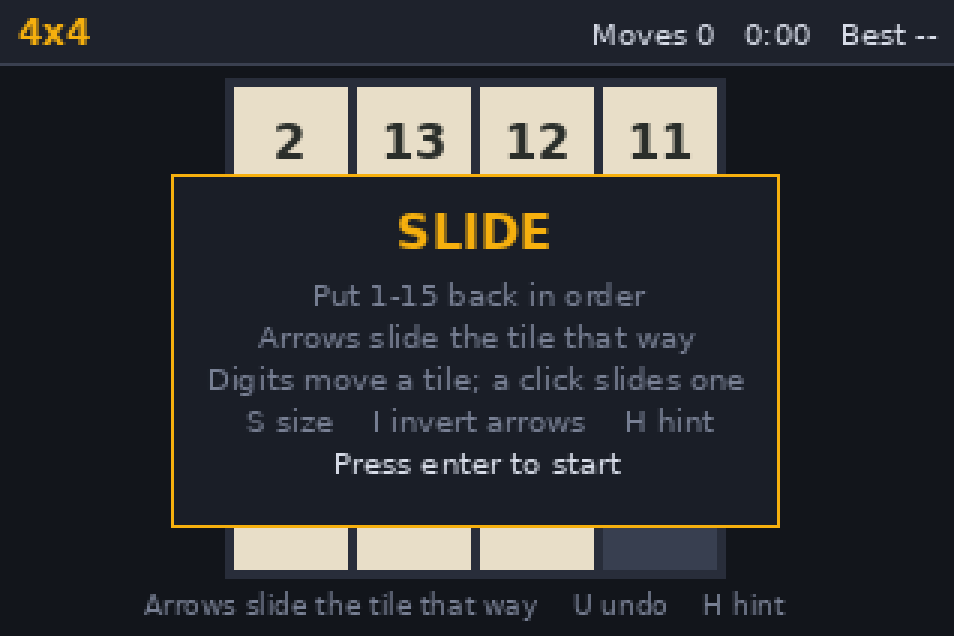
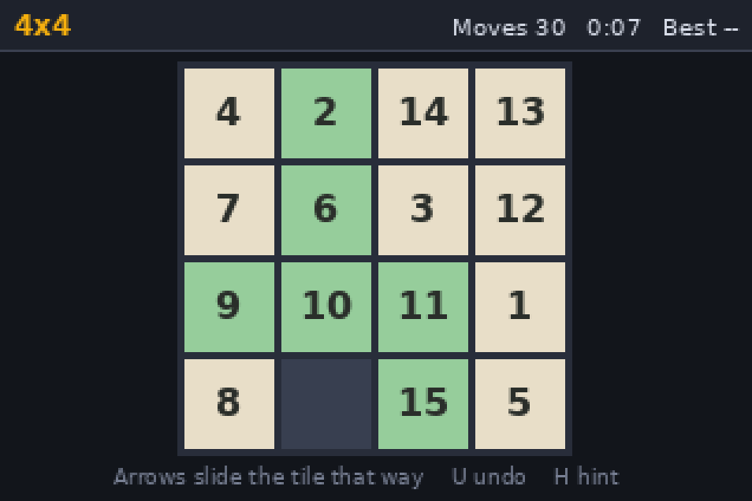

| Key | Action |
| --- | --- |
| Arrows, or `2`/`4`/`6`/`8` | Slide the tile in that direction into the gap |
| `enter` | Start, resume, deal a new puzzle |
| `esc` or `P` | Pause |
| `U` or `backspace` | Undo — unlimited, all the way back to the deal |
| `R` | New puzzle at the same size |
| `S` | Change size: 3x3, 4x4, 5x5 |
| `I` | Invert the arrow convention |
| `H` | Hint — plays one move toward a solution |
| Click | Slide the clicked tile, and any run of tiles between it and the gap |

A tile that is already in its final position is drawn green, which costs one
comparison per tile and turns "am I getting anywhere?" into something you can
see at a glance.

### The scramble is the whole game

Exactly half of all permutations of a sliding puzzle cannot be reached from the
solved state. Shuffle by permuting the tiles at random and half the puzzles you
deal are impossible — and the player has no way to tell an impossible board
from a hard one. They just lose to the generator after ten minutes of honest
work.

So the scramble never permutes anything. It starts from the solved board and
makes a few hundred random *legal moves*, which makes an unsolvable board
unrepresentable rather than merely detected — the same reason Flappy's pipe
generator is fenced by the physics instead of filtered afterwards. The walk
never immediately retraces its last step, or it would spend half its time
wandering back toward solved.

A random walk can still land somewhere easy by chance, so a deal is rejected
and re-walked if it is too close to solved. The floors are a minimum count of
misplaced tiles and a minimum sum of Manhattan distances, both set at the 5th
percentile of what a walk of that length actually produces — measured, not
guessed, so rejection is rare and does not bias what is left.

`Puzzle.isSolvable` then implements the inversion-parity rule anyway, and
nothing in the game ever calls it. It exists so that two independent mechanisms
have to agree: count the inversions reading row by row and ignoring the gap,
and on an odd-width board the position is solvable iff that count is even,
while on 4x4 it is solvable iff inversions plus the gap's row counted from the
bottom is odd. That formula is easy to get subtly backwards, and a backwards
oracle agreeing with a backwards shuffler would prove nothing — so the tests
pin it first against boards whose solvability follows from how they were built
(the solved board, a single transposition, Sam Loyd's 14-15 puzzle) before
letting it judge anything.

The invariant that catches the subtler bug is the third one: **a legal move
never changes solvability.** Thousands of random slides at every size, with the
oracle re-run after every single one. A move implementation that quietly
corrupts the board fails there and nowhere else.

### Arrows and clicks

The arrow convention has to be stated, because the two readings are exact
opposites and the wrong one feels broken rather than merely unfamiliar. Here an
arrow names the direction **the tile** travels: pressing Left slides the tile
sitting to the right of the gap leftwards into it, so the gap moves right.
`I` swaps it for the other reading, since preferences genuinely differ, and
whichever is in force is written under the board.

`2`, `4`, `6` and `8` do the same thing as the arrows. The number pad is laid
out `7 8 9` / `4 5 6` / `1 2 3`, so those four digits sit exactly where the
arrows point, and Snake and 2048 already take them — someone moving between the
games shouldn't have to relearn the keys. They follow the `I` toggle too.

Clicking a tile in line with the gap but not next to it slides the whole run of
tiles between them, which is what this puzzle has always done and what people
reach for without being told. A single-step move is just the one-tile case of
the same operation, which is also why undo is unlimited and costs nothing: the
inverse of a run slide is the same run slide back the other way, so one gap
position is the entire undo record — no snapshot per move.

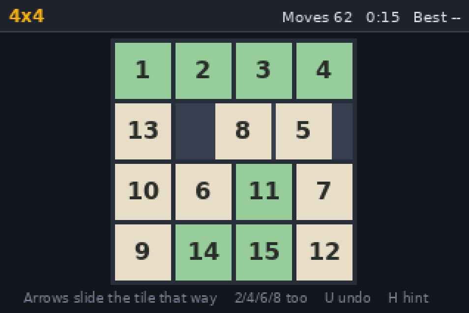
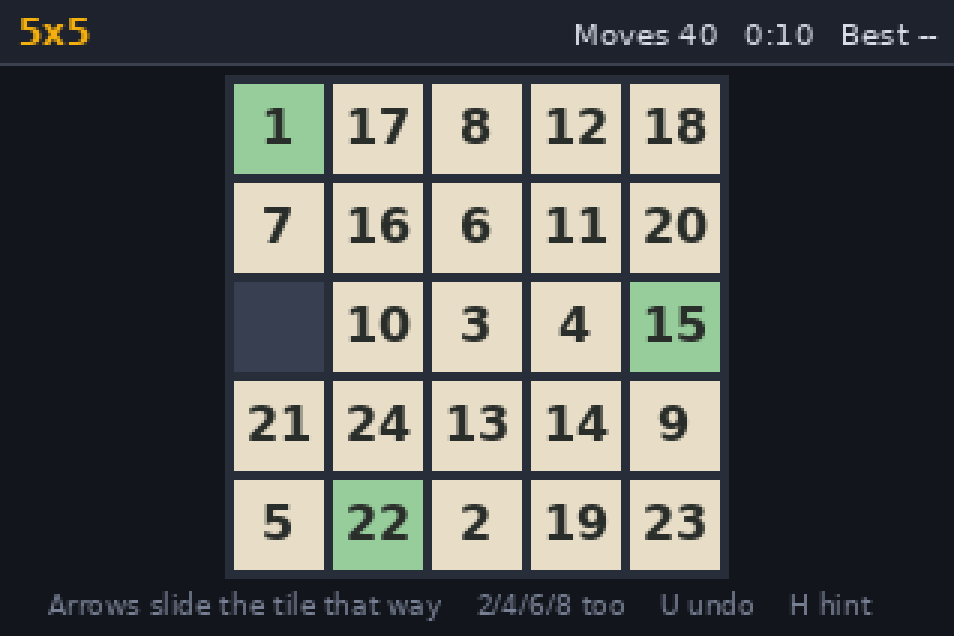

Board size is the difficulty setting, and the rules are size-generic, so it
costs almost nothing. The tile numbers are sized from the *widest* label on the
board rather than each from its own, because fitting `1` and `24` independently
would set them at different sizes and the grid would come out visibly ragged —
the same trap Wordle's keyboard hits with `I` and `W`.

Like 2048, it runs no game loop: the screen repaints when you press a key and
not otherwise. The timer slides tiles, ticks the clock, and feeds the hint.

### The hint, and what it costs

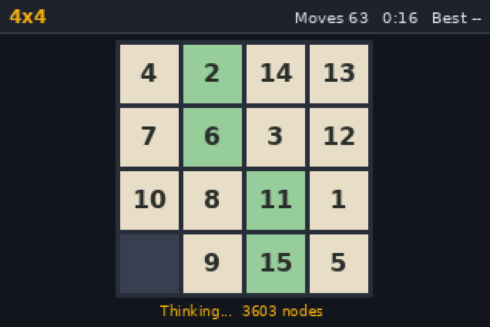
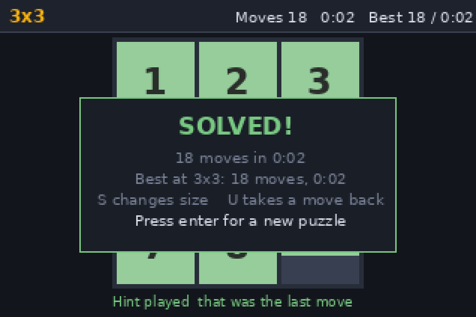

`H` plays one move toward a solution. Solving this puzzle *well* means IDA\*
with Manhattan distance plus linear conflict, which is expensive, so it is a
sliced state machine budgeted across timer ticks exactly like Connect Four's
`ai:think()` — running it to completion inside one `on.timer()` would freeze
the screen and queue up keypresses, which a player reads as a crash. Slicing
changes only *when* it answers, never *what*, and a test asserts that: fed 17
nodes at a time it returns the identical path to the same search run straight
through.

Optimal is expensive, and the honest consequence is that a freshly dealt 4x4
needs a solution around 50 moves long and will not be solved inside any budget
a handheld can spend. So the hint says **"No solution found in budget"** rather
than returning a move it cannot justify. It does finish on 3x3 — the win
screenshot above is a 3x3 played out entirely by the hint, through the real UI
— and on 4x4 endgames. 5x5 is refused outright, because optimal search at that
size is hopeless and pretending otherwise would just burn ticks.

## Fruits

Match three. Swap two neighbouring fruit to line up three or more, they clear,
the ones above fall in, and whatever lands may line up again.

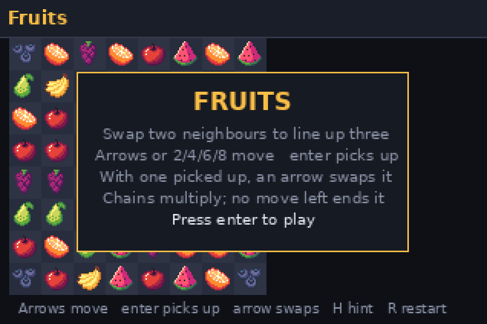
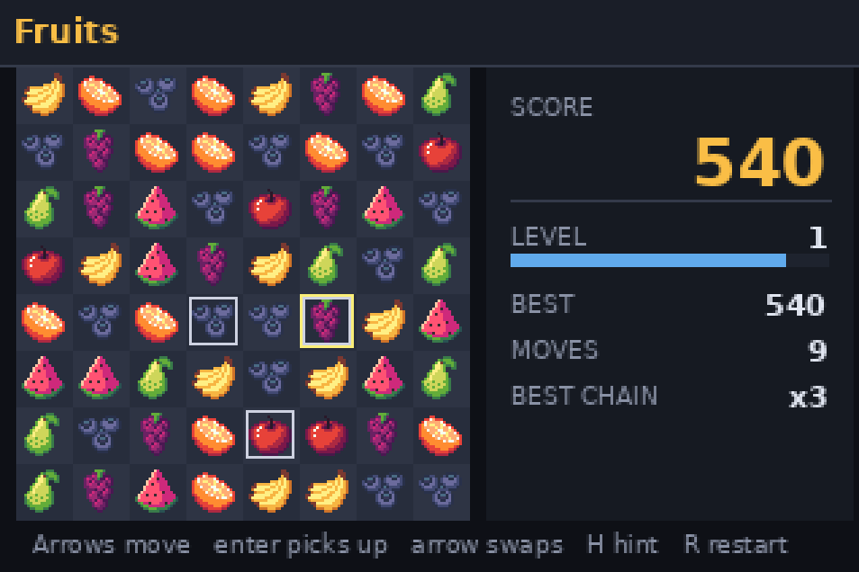

| Key | Action |
| --- | --- |
| Arrows, or `2`/`4`/`6`/`8` | Move the cursor |
| `enter` or space | Pick a fruit up, or put it down |
| Arrow, with a fruit picked up | Swap it that way — one keypress, no confirm |
| `esc` or `P` | Pause |
| `H` | Hint — lights a swap that works, for 20 points |
| `R` | New board |
| Click | Pick up; click a neighbour to swap with it |

A clear is worth 10 a fruit, plus 20 for each one past the third, times a
multiplier that grows down the cascade: x1, x2, x3, x5, x8, x12. Clearing fruit
also fills the level bar, and each level asks for more than the last and pays a
bonus for reaching it — the level measures how much board you have got through,
the score measures how well, and points per fruit deliberately do *not* scale
with the level so a clear has one value rather than two multiplied together.

Sit still for about five seconds and the game lights a legal swap for you,
free. `H` is the same thing asked for deliberately, and that one costs 20 —
a player who has stopped moving has usually stopped *seeing*, and charging them
for a prompt they did not ask for would be a strange thing to do.

The round ends when no swap anywhere on the board would do anything.

The swap-by-arrow is the route that actually gets used, so it is one keypress:
pick a fruit up with `enter`, then press the direction you want it to go. The
alternative — steer to the second cell and confirm — is three keys for the same
move, and on a handheld with no key-repeat worth having, that is the difference
between playing and typing.

### The board must never be unplayable, and must never play itself

Deal an 8x8 board at random and it will regularly detonate into a cascade
before the player has touched it: about four boards in five drawn uniformly
already contain a run. Dealing and rerolling would work. Instead the board is
filled cell by cell, left to right and top to bottom, **excluding any fruit
that would complete a run with the two cells to its left or the two above** —
which are the only runs such a fill can complete. That excludes at most two
kinds out of seven, so the fill can never paint itself into a corner and need a
restart. An already-matching board is not rejected; it is unrepresentable, the
same way `src/slide/game.lua` makes an unsolvable puzzle unrepresentable by
walking legal moves instead of permuting tiles.

A fresh board also has to have at least one legal swap, or the player opens
onto a dead board with nothing on screen to say why. That one is resampled
rather than designed away — measured over 200,000 deals here, no deal has ever
needed a second try — and if a degenerate generator ever exhausted the retries
there is a deterministic fill behind it that the tests pin as playable.

`Fruit.scanRuns` and `Fruit.allLegalSwaps` then implement both checks that were
designed away — a naive run scanner and a brute force that tries every swap and
rescans the whole board — and **nothing in the game ever calls either**. They
exist so two mechanisms sharing no code have to agree, and the tests pin them
first against boards whose answer follows from how they were built, because a
backwards oracle agreeing with a backwards generator proves nothing. A test
reads `src/fruits/game.lua` and fails if the game ever starts calling them.

**The trap is right next door, and it is the opposite one.** Fruit falling in
after a clear *are* allowed to match — that is what a cascade is. Apply the
no-match fill there too and every test above still passes while cascades
quietly leave the game. So the tests assert both directions: a fresh deal never
matches, and the mid-cascade refill sometimes does.

### Specials


Following Bejeweled 2, which is where most people's expectations of a
match-three come from:

- **four in a line, or an L / T / +**, merges into a **power fruit**. It keeps
  its colour and matches like anything else, but when it clears it takes the
  eight cells around it, and a blast that catches another power fruit sets that
  one off too, so they chain.
- **five or more in a line** merges into a **rainbow**, drawn as a cut
  dragonfruit because pale is the one thing none of the seven playable fruits
  is. It has no colour and can never be matched. Swap it with a neighbour and
  it is *spent*: every fruit of that neighbour's kind leaves the board. Two
  rainbows swapped together clear everything, which is the only sensible
  reading of "all of the other one's colour" when the other one has no colour.

The distinction worth stating because it is easy to get backwards: **five cells
in an L is a power fruit, not a rainbow.** A rainbow needs five in one straight
run. So the decision is made per run and per cluster of overlapping runs, which
is why the matcher keeps the runs it found and not only the cells it marked.

Two consequences fall out of the rainbow, and both reach further than the
drawing code:

**It changes what "no legal swap" means.** A rainbow is spent rather than
matched, so a swap touching one always does something and is therefore always
legal — which means a board holding a rainbow essentially never deadlocks. Both
the production move-finder and the brute-force oracle carry that clause, and so
does the frame reader, which learns which sprites are ordinary by looking at
*fresh* boards — they hold no specials by construction, so anything seen later
and not in that set is one. Without that the reader's idea of "no moves left"
quietly stops being the game's, and a board carrying a rainbow reads as
deadlocked while the game plays happily on.

**It changes what a cell can hold.** A cell is now 1..7, or the rainbow; a
power fruit is a flag alongside, because it keeps its colour. That is a
deliberate split rather than two flags: the rainbow is a *kind* precisely so
that it equals no ordinary fruit, and every run scanner here compares cells for
equality, so a rainbow can never join a run without anyone writing a special
case for it.

A power fruit is marked by a ring that throbs — stepping from tight around the
fruit out to the edge of the cell and back, **dimming as it grows**. The fading
is what makes it read as a glow swelling outward rather than as a white box
being resized; at a constant brightness the largest step is just a loud
rectangle, and it competes with the cursor ring, which lives at the cell edge
too. A ring rather than a tint because `gc:drawImage` cannot recolour a sprite,
and an outline rather than a fill because nothing but fruit is ever filled
inside a cell.

Animating a *settled* board is the one thing here that costs something a still
board did not pay before, so it is gated twice: the throb repaints only when it
actually changes step — once every three ticks, not every tick — and only while
there is a power fruit on the board to throb. With none, a settled board still
repaints exactly never.

That broke the test harness in an interesting way. `tests/fruits/frame.lua` used
to decide the board had settled by watching the repaint requests dry up, which
a board that throbs forever never does. It now watches the *fruit* instead —
two consecutive frames where nothing has moved — which is the more honest
question anyway, since that is what "settled" was always supposed to mean.

Gravity had to learn about them too — a power fruit that falls has to arrive
still being one, or it hands its blast to whatever landed underneath — and the
refill never hands out a special, because a special is something the player
earned from a match.

### The cascade is a state machine, not a loop

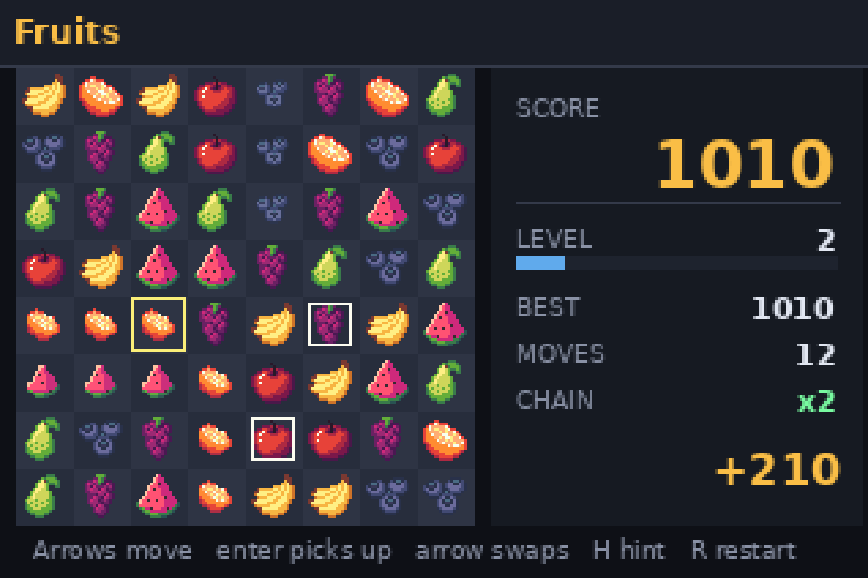

Clear, drop, refill, rematch, repeat — and every step has to be *seen*. There
are no threads on this device and no way to yield, so running the cascade as a
loop inside one `on.timer()` would freeze the screen and queue up keypresses,
which a player reads as a crash. It is an explicit machine instead —
`idle → swap → clear → fall → clear → … → idle` — that the timer advances one
phase per few ticks, living in `game.lua` so the tests can drive it straight
through, exactly like Connect Four's sliced search.

An illegal swap is one of its states: `swap → unswap → idle`, so the two fruit
visibly trade places and come back. Silently refusing leaves the player unsure
the key even registered.

The clear phase has an order that each step depends on: the cells that *merge*
into a special come out of the marks first, so a special never destroys itself;
then power fruit go off, to a fixpoint, because one blast can set off another;
only then is the total scored, which is what makes a chained blast worth what
it actually cleared.

The work of a phase happens as it is *left*, so while a phase is on screen the
board holds exactly what that phase is meant to show — during `clear` the
matched fruit are still there and marked; during `fall` the board already holds
the settled result and a motion record says where everything came from.

The test that matters is that **resolving a cascade one tick at a time reaches
the identical board and the identical score as resolving it in a single call.**
`Fruit:tick` contains no game logic at all — it only decides when `advance()`
is called — and that test fails the moment someone moves a rule up into it.

### Drawing 64 sprites twenty times a second

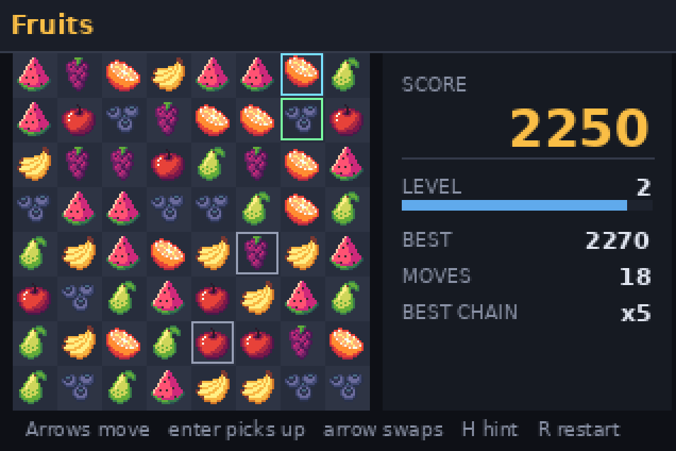

Chess and Klondike draw their art as `fillRect` runs because the byte layout
`image.new` wants is documented only by TI, and a wrong guess paints nothing
with no error to chase. That is still true — but it is now *known*, because it
was measured on a real calculator rather than guessed at.

`tools/probe/imageprobe.lua` tried twelve plausible header layouts and three
call signatures. None painted. The format is in fact documented on the
[Inspired-Lua wiki](https://wiki.inspired-lua.org/index.php?title=TI.Image):
a **20-byte little-endian header** — width, height, alignment, flags, padding,
row stride, bits per pixel, planes — followed by 16-bit pixels laid out
`A RRRRR GGGGG BBBBB`, **RGB555 with alpha in the top bit**, where 0 means the
pixel is not drawn. The first probe had guessed a 16-byte header and RGB565;
either mistake alone is fatal. `tools/probe/imageprobe2.lua` then confirmed all
of it on a CX II, including that a deliberately wrong stride is rejected with
*"image header mismatch"* rather than silently painting nothing, and that
clearing the alpha bit really does make a pixel transparent.

So a board is **64 `drawImage` calls** rather than the ~4100 rects the same
pixels cost as rectangles, which matters here in a way it does not for chess:
chess repaints on a key press, and this repaints on every tick of a cascade.
The busiest frame a cascade produces measures 618 draw calls, against a
1400 ceiling the tests enforce.

The rects are still generated, and they are not a lesser picture — the sheet
uses four to seven colours a sprite, so nothing is quantised and the two
encodings are the same pixels. They cover the two cases `drawImage` cannot: a
cell too small for a native 16-pixel sprite, which is any window much below the
handheld's, and an OS that will not take the string form of `image.new`. That
fallback is all-or-nothing — half a board in each encoding would look like a
bug — and the tests exercise it by making `image.new` fail, then assert the two
paths paint the identical board.

`tools/fruitart.py` rebuilds both encodings from exactly the characters it
wrote, compares each against the source pixels, and compares the two against
each other. A sprite that would draw wrong on the handheld is a build failure
here instead of a surprise on the calculator.

The seven fruit are chosen to differ by **silhouette** and not only by colour —
a round one, a crescent, a big loose cluster, a wedge, a teardrop, a triangle
and a small tight cluster. The near-misses were left out deliberately: cherry
and strawberry are the apple's red, pineapple and lemon are the banana's
yellow, and a whole orange is the apple's circle again, which is why the orange
here is a cut slice. Seven rather than more because an 8x8 board with more
colours than that makes runs rare and deadlock quick.

### Reading the board back off the screen

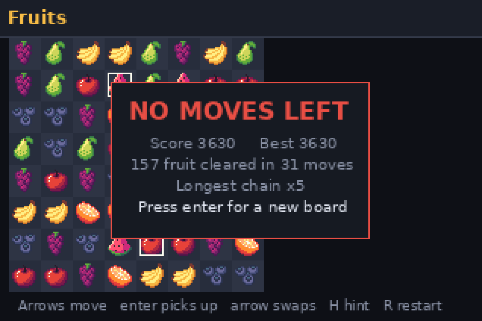

`tests/fruits/frame.lua` recovers the board from the paint calls and works out
the runs and the legal swaps for itself. That is a *third* implementation:
`game.lua` has the rules, `game.lua`'s oracles check those rules against a
second one, and this checks the **screen** against a third — the only one of
them that would catch a board computed correctly and drawn somewhere else, or a
fruit painted as the wrong sprite. It reads both draw paths: on the image path
a cell's fruit is the image drawn in it, and on the rects it is the set of
colours filled inside the cell.

Nothing but fruit is ever *filled* inside a cell — the cursor and the hint are
outlines — and that is what lets the reader take every fill as art without
having to subtract chrome that moves around. A test pins it by learning the
art's own palette from the rect path, where every fill is art by definition,
and then failing if a cascade on the image path ever puts a colour in a cell
that is not in it. It earned its place immediately: a bursting fruit used to
shrink over a near-white backing rect, which on a real calculator reads as a
rendering fault rather than as a cue.

The cursor is one ring, not two stacked. Picking a fruit up never moves the
cursor off it — an arrow with something picked up performs the swap rather than
steering — so the two are always the same cell, and the ring changes colour
while the fruit under it lifts a couple of pixels. A test pins that premise, so
the single ring stops being correct loudly rather than quietly if the input
handling ever changes.

Settling is judged from the repaint requests rather than the picture, and the
reason is worth writing down: at the very start of a swap the two fruit are
drawn at each other's cells, so all sixty-four cells hold exactly one fruit and
the board looks perfectly settled while a swap is in fact under way.

### The board that was the same every time

Like Slide, Fruits owns its random number generator instead of seeding
`math.random`, which does nothing on the handheld. That was not enough, and the
way the gap was found is worth recording.

The board behind the title screen is dealt when the document loads — at which
point the only entropy that exists is the generator's initial seed. Pressing
`enter` started the round without dealing a new one, so **every launch played
the identical board**: Wordle's bug in a different coat. The round is now dealt
at the moment play starts, seeded from how long the player sat on the title
screen, which on a handheld with no clock worth reading is the only thing that
differs between two launches.

The test that should have caught it had been passing all along, for the wrong
reason. It compared boards by the identity of the sprites drawn in each cell,
and the mock handed out image handles from a counter that ran for the life of
the process rather than restarting per document — so two launches of the *same*
board produced different handles and looked different. Fixing the mock to
number images per document, which is what the calculator does, turned a test
that could not fail into one that did.

## Installing

1. Connect the calculator over USB. On a Mac the easiest route is
   [TI-Nspire CX II Connect](https://nspireconnect.ti.com) — free, web-based,
   nothing to install, but it **requires Chrome**; Safari has no WebUSB and
   will fail in a way that looks like a hardware fault. TI-Nspire Student or
   Teacher Software works too.
2. Drag `Snake.tns`, `Flappy.tns`, `2048.tns`, `Connect4.tns`, `Chess.tns`,
   `Wordle.tns`, `Klondike.tns`, `Slide.tns` or `Fruits.tns` into the
   calculator's file list.
   They must land in **My Documents** directly, not a subfolder.
3. On the handheld, open **My Documents**, pick one, and press `enter`.

There is nothing else to install. Each `.tns` is a normal TI-Nspire document
that happens to contain a Lua script, so the OS runs it in its built-in
sandbox exactly like a TI-authored one.

Requires OS 3.0.2 or newer, which every CX II ships with.

## Building it yourself

You only need this if you want to change a game; the committed `.tns` files
are ready to use.

```
make GAME=snake                # build Snake.tns   (GAME defaults to snake)
make GAME=flappy               # build Flappy.tns
make GAME=2048                 # build 2048.tns
make GAME=connect4             # build Connect4.tns
make GAME=chess                # build Chess.tns
make GAME=wordle               # build Wordle.tns
make GAME=klondike             # build Klondike.tns
make GAME=slide                # build Slide.tns
make GAME=fruits               # build Fruits.tns
make GAME=flappy test          # that game's logic + runtime tests
make GAME=flappy screenshots   # preview PNGs -> build/flappy/screenshots
make all-games                 # build everything under src/
make list                      # list games
make probes                    # throwaway .tns that ask real hardware a question
make clean
```

Requirements:

- **[luna](https://github.com/ndless-nspire/luna)** on your `PATH` — the
  open-source Lua-to-`.tns` converter. Clone it, `make`, and copy the binary
  somewhere on your path. It needs zlib (`zlib1g-dev` / `zlib-devel`).
- **python3** for the bundler.
- **Lua 5.1** for the tests (optional, but you want it).
- **Pillow** (`pip install Pillow`) for `make screenshots` (optional).

If you'd rather not build anything, paste `build/<game>/<game>.lua` into the
Student Software's script editor (**Insert > Script Editor**) and save the
document from there — same result, more clicking.

## How it's laid out

```
src/<game>/game.lua       rules -- pure Lua, no calculator APIs
src/<game>/main.lua       drawing, input and timing for the Nspire
assets/<game>/            source art, where a game has any
tests/<game>/run.lua      logic tests
tests/<game>/frame.lua    reads a game's state back out of a painted frame
tests/<game>/ui.lua       game-specific frame assertions
tests/<game>/autoplay.lua plays itself, for screenshots

tests/nspire_stub.lua     shared: mock of the Nspire runtime
tests/run_ui.lua          shared: game-agnostic runtime tests
tools/                    shared: bundler, frame capture, PNG renderer
tools/sprites.py          chess only: piece art -> Lua run-length spans
tools/cardart.py          klondike only: card art -> Lua run-length spans
tools/fruitart.py         fruits only: sprites -> TI.Image strings and rects
tools/wordlist.py         wordle only: word lists -> a Lua string to search
tools/probe/              throwaway documents that ask real hardware a question
build/<game>/<game>.lua   generated: the script that goes into the .tns
<Game>.tns                generated: the file you copy to the calculator
```

The harness is shared between games; only the files under `src/<game>/` and
`tests/<game>/` are per-game. `CLAUDE.md` has the details for adding another.

The logic/presentation split matters more than it looks. `game.lua` touches no
`platform`, `gc`, or `timer`, so the rules run under a desktop Lua and can be
tested directly. Everything calculator-shaped lives in `main.lua`.

The handheld has no `require`, so `tools/bundle.py` inlines the logic module
into a single file and puts `platform.apilevel` on line 1, where the OS looks
for it.

## Testing without a calculator

Dragging a `.tns` over USB for every change gets old fast. Three options,
roughly in order of how quickly they catch things:

**`make GAME=<game> test`** — two suites, no calculator involved.
`tests/<game>/run.lua` covers the rules: for Snake, turn queueing, the
tail-follow exception, food placement on a nearly-full board and the win
condition; for Flappy, the physics and the reachability of every generated
gap; for 2048, the merge rules where all the bugs live — merge-once-per-move,
merge order by direction, what makes a move legal, and game over as "no
direction changes the board" rather than "the board is full". All of them end
with a fuzz pass checking structural invariants over thousands of steps.

Connect Four has unusually strong testable properties, and its suite leans on
them. Win detection is checked in all four directions at every position on the
board, and — because the game only ever looks at lines through the last disc
played — against a full-board scan after every move of twelve hundred random
games. The pruned search is checked against a slow, obviously-correct minimax
written inside the test file: over many random positions, at the same depth,
alpha-beta has to pick a move of equal value. The sliced search is checked
against the same search run in one shot, node for node. And the bot plays
fuzz matches against a random player, which it must essentially never lose.

Between them those caught two bugs that no amount of reading would have: the
search left its discs on the board when a budget ran out part-way, and the
board being painted was the board being searched.

Chess is checked the same way and then some. Perft is the centre of it — see
the table above — because a rule test can only be as good as the case someone
thought to write, while perft counts every leaf of the whole move tree against
a number the outside world already knows. On top of that: castling rejected out
of, through and into check but *not* when only b1 is attacked, which is the
half of that rule usually got wrong; en passant legal only on the move right
after the double push, and rejected when taking would uncover the king; every
drawing rule; the pruned search against a plain negamax written in the test
file; the sliced search against the one-shot, node for node; and mate-in-one
and mate-in-two positions, each proved to be one by a brute-force prover in the
test before the bot is asked to find it. That last habit caught two of the
author's own "mate in one" positions being nothing of the sort.

Klondike has almost no rule tests at all, because that is not where a solitaire
implementation breaks. Its suite is a continuous fuzz that re-checks the deck,
the tableau runs, the foundations and the face-down counts after every one of
tens of thousands of random legal moves, plus make/unmake exactness over every
legal move from thousands of positions and a two-way comparison of the move
generator against the validator. The one derived rule test that is written out
longhand — draw the whole stock, recycle, and demand the identical array back —
is the one that found a real bug: the draw-3 groups were arriving on the waste
the wrong way round.

`tests/run_ui.lua` loads the *actual bundled script* against
`tests/nspire_stub.lua`, a mock of the calculator's runtime that is
deliberately stricter than the real one: it rejects colours outside 0–255,
unsupported font sizes, bad anchors, and negative rectangles. The Nspire
ignores a malformed drawing call silently, which on hardware shows up as "the
screen looks wrong" with nothing to debug — the mock turns that into a failing
test instead. Each game adds its own frame assertions in `tests/<game>/ui.lua`.

Fruits is checked against three implementations of its own rules, not two.
`game.lua` has the matcher and the move finder; `Fruit.scanRuns` and
`Fruit.allLegalSwaps` are naive from-the-definition versions that the game
never calls, and a test reads the source and fails if it ever starts; and
`tests/fruits/frame.lua` works the runs and the swaps out a third time from
the *painted frame*, which is the only one of them that would catch a board
computed correctly and drawn somewhere else. Its headline test is that
resolving a cascade one tick at a time reaches the identical board and score
as resolving it in a single call.

**`make GAME=<game> screenshots`** — plays the game through the mock and
rasterizes real frames to PNG at the handheld's true 318x212, so you can see a
layout change without leaving the terminal. The simulated player reads the
world back out of the paint calls rather than reaching into the game's
internals, so no test-only hooks leak into the shipped script. Klondike goes
furthest with this: `tests/klondike/frame.lua` identifies each card on screen
by matching the ink it drew against the art in the bundle, clipped to the strip
that card is actually showing, and says so when a strip is too thin to tell two
cards apart — which is the honest answer rather than a limitation.

**An emulator** — [Firebird](https://github.com/nspire-emus/firebird) runs
CX II images and opens `.tns` files directly, with a Lua console for live
poking. This is the last check before real hardware. It needs a boot image and
OS dumped from a calculator you own.

## Credits

The playing cards are
[Kin Pixel Playing Cards](https://the-wild-kin.itch.io/kin-pixel-playing-cards)
by **KIN**, a free ("name your own price") pack whose description says *"Feel
free to use these assets in anyway you please, although I'd appreciate paying
the suggested price if used commercially."* That wording could not be read from
the source here — itch.io is blocked by this container's egress proxy — so
`assets/klondike/README.md` records where it came from and says so plainly
rather than implying it was verified. The PNGs are kept exactly as published;
`tools/cardart.py` turns them into spans a calculator can draw.

The chess pieces are [Pixel Chess](https://brosen.itch.io/pixel-chess) by
**brosen**, used under the pack's own terms. The source PNGs are kept in
`assets/chess/` exactly as published; `tools/sprites.py` is what turns them
into something a calculator can draw.

Wordle's accepted-guess list is **SCOWL** (Spell Checker Oriented Word Lists),
Copyright 2000-2011 Kevin Atkinson, taken from Debian's `wamerican-huge`
package and filtered to five letters. SCOWL's terms are permissive and ask that
the notice travel with the words, so it does: `assets/wordle/SCOWL-COPYRIGHT.txt`.

The answer list came from the original Wordle's JavaScript bundle and carries
**no stated licence** — see `assets/wordle/README.md`, which says so plainly
rather than pretending otherwise. Swapping in a different list is one file and
one command.

Fruits' sprites are a **CC0** sheet supplied by the repository owner — public
domain, so no attribution is required and none is owed. The author's name and
the page it came from were not recorded and cannot be recovered from this
container, which means the terms rest on the owner's word rather than on a
source that was read here; `assets/fruits/README.md` says so plainly. The sheet
is kept whole and exactly as supplied; `tools/fruitart.py` is what turns seven
of its sprites into something a calculator can draw.

Everything else here is original.

## What isn't verified

The tests and screenshots run against a *model* of the calculator, not the
calculator, and the gap is not theoretical. Wordle shipped dealing the same
word on every launch — `math.randomseed` returns without complaint on the
handheld and changes nothing, so `math.random` replays one sequence from one
open of the document to the next. The mock hid it by seeding `math.random`
itself before neutralising `randomseed`, so every test saw fresh values. It
took playing the `.tns` on a real calculator to see it, and the fix was to stop
using `math.random` for the answer at all.

Slide and Fruits were written after that and own their generators from the
start, for the same reason: a puzzle that deals the identical scramble every
time the document is opened is the same bug wearing different clothes. The
remaining six games still seed the old way, so on hardware they will deal the
same opening every launch — the same food, the same pipes, the same tiles.

The rest of what only real hardware can settle:

- **Font metrics.** The mock measures text with DejaVu; the Nspire has its own
  font. The layout code always asks the device's own `getStringWidth` at
  runtime, so boxes size themselves correctly either way, and the HUD drops its
  title rather than letting a long score collide with it. But the preview
  images are representative, not exact.
- **Bot speed.** How many search nodes a second the handheld manages is the
  one number in Connect Four, Chess and Slide's hint that is an estimate rather
  than a measurement —
  the container the tests run on is an x86 desktop. The design does not depend
  on getting it right: the bot's turn is capped in *ticks*, and iterative
  deepening means a slower machine simply plays a shallower search rather than
  hanging. If your calculator is slower than assumed, the bot is a little
  weaker; if it is faster, the bot finishes early and the node budget takes
  over.
- **Timer pacing.** Snake and Flappy run a fixed 0.05 s timer and count ticks
  rather than restarting the timer at new intervals, because granularity varies
  between Nspire OS versions. If your handheld's timer is coarser than 0.05 s
  they run proportionally slower — they won't misbehave, but Snake's top speeds
  may not be reachable, and Flappy will feel heavier than intended. 2048 is
  unaffected: it is turn-based, and a coarse timer only makes its slide
  animation longer, and Connect Four, Chess and Slide's hint only spend longer
  on their search.
- **Whether `fillRect` is fast enough for the pieces.** A full board is ~940
  rects per repaint. On this container that is imperceptible, and chess only
  repaints when you press a key, but the handheld is the one that has to draw
  them. If it turns out too slow the fix is cheap — drop the rim and fall back
  to the plain silhouettes, which is 336 rects.
- **Whether a cascade keeps up.** Fruits repaints on every tick of a cascade,
  which is the one thing here that draws a full screen at the timer's rate. The
  busiest frame measures 618 draw calls; at the 50x handheld factor assumed
  above that is roughly 4 ms of a 50 ms tick, so there is a lot of room. If the
  factor is badly wrong the cascade animates more slowly rather than freezing —
  the phase machine counts ticks, not wall clock — and the game stays correct
  and responsive either way.
- **Whether the font has chess glyphs.** It is not verified that the Nspire's
  font carries U+2654–U+265F, and a missing glyph on this OS is a silent empty
  box — which across sixty-four squares would be unreadable rather than merely
  ugly. Chess never tries: pieces are sprites, and the small-window fallback is
  plain Latin letters.
